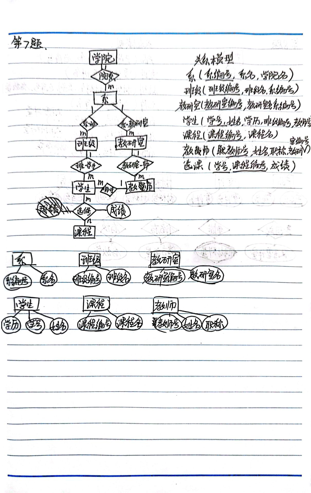
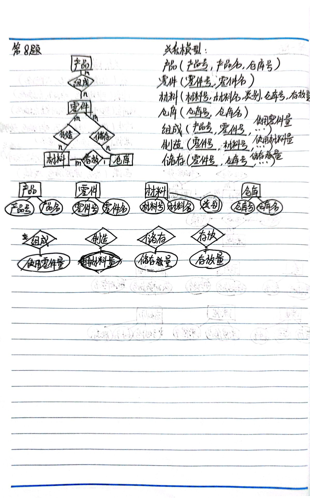
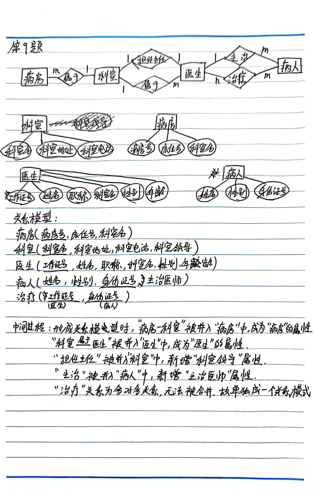
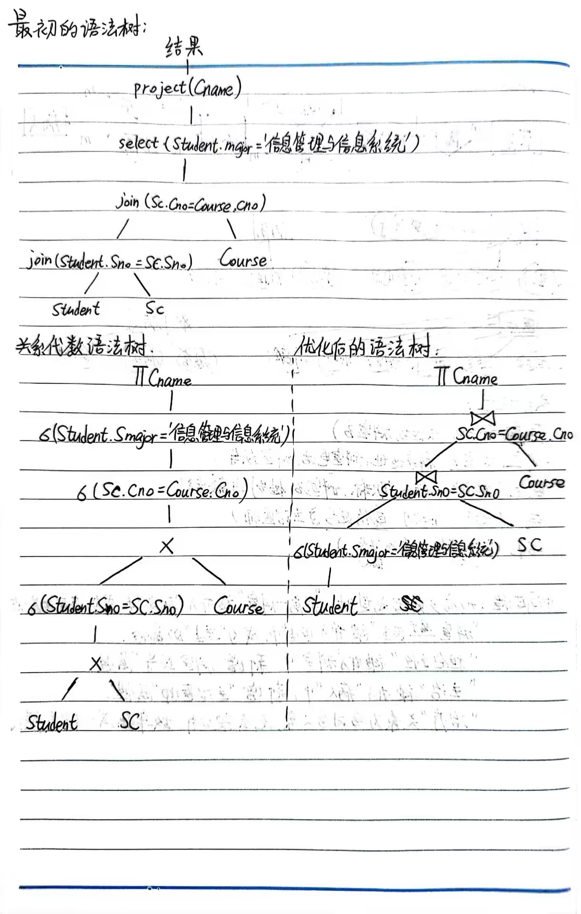
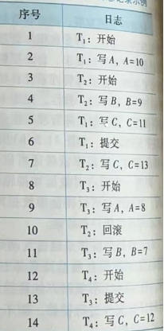

# 数据库系统-作业

甘晴void


## 第一章作业 10.09

1.(名词解释)试述数据、数据库、数据库管理系统、数据库系统的概念。

> 数据，是描述事物的符号记录。
>
> 数据库（DB），是长期存储在计算机内、有组织、可共享的大量数据的集合。数据库中的数据按一定的数据模型组织、描述和储存，具有较小的冗余度、较高的数据独立性和易扩展性。
>
> 数据库管理系统（DBMS），是计算机的基础软件，主要负责管理数据库。
>
> 数据库系统（DBS），是由数据库、数据库管理系统及其应用开发工具、应用程序和数据库管理员组成的存储、管理、处理和维护数据的系统。

2.(简答题) 试述文件系统与数据库系统之间的区别和联系。

> 区别：
>
> （1）数据库系统能实现整体数据的结构化，即数据之间是有联系的。
>
> （2）数据的共享性高，冗余度低且易扩充，可以避免数据之间的不相容性与不一致性。
>
> （3）数据的独立性高，具有逻辑独立性与物理独立性。
>
> （4）数据又数据库管理系统统一管理和控制，具有安全性保护、完整性检查、并发控制、数据库恢复等功能。
>
> 联系：
>
> 文件系统和数据库系统都用于存储和管理数据。文件系统可以被视为一种简单的数据存储方式，适用于小规模的数据和应用。数据库系统更适合于大规模数据存储和管理，提供了更多的数据管理功能和性能优化


3.(简答题) 试述数据库系统的三级模式结构，并说明这种结构的优点是什么。

> 三级模式结构：
>
> 数据库的三级模式结构是由外模式、模式和内模式三级构成。模式是数据库中全体数据的逻辑结构和特征的描述，是所有用户的公共数据视图。外模式是数据库用户能看见和使用的局部数据的逻辑结构和特征的描述，是数据库用户的数据视图。内模式是数据物理结构和存储方式的描述，是数据在数据库内部的组织方式。
>
> 优点：
>
> 三级模式和由其衍生出的两层映像保证了数据库系统中的数据能够具有较高的逻辑独立性和物理独立性。


4.(简答题) 试述数据与程序的物理独立性和逻辑独立性。为什么数据库系统具有较强的数据与程序的独立性。

> 物理独立性：用户的应用程序与数据库中数据的物理存储是相互独立的。
>
> 逻辑独立性：用户的应用程序域与数据库的逻辑结构是相互独立的。
>
> 原因：三级模式与两层映像。
>
> 外模式/模式映像中，由于应用程序是依据数据的外模式编写的，当模式改变时应用程序不需更改，只需更改映像规则即可，这里体现了逻辑独立性；
>
> 模式/内模式映像中，若需更改数据库的存储结构，只需更改映像而不必改变应用程序，这里体现了物理独立性。

5.(简答题) 试述数据库系统的组成。

> 数据库系统一般由硬件平台及数据库、软件、人员组成。
>
> 其中人员一般包括数据库管理员、系统分析员和数据库设计人员、应用程序员、最终用户这四类。


## 第二章作业 10.16

1.试述关系模型的完整性约束。在参照完整性中，什么情况下外码属性的值可以为空值？

> 完整性约束：
>
> （1）实体完整性：主键列包含对每个元素的唯一值且非空
>
> （2）参照完整性：外键的值必须是一个主键值或者取空值，若外键值不为空，它必须存在于其关联主表的主键列中
>
> （3）用户定义完整性：这部分是用户可以自己定义的约束条件，包括唯一约束、主键约束、自增长约束、默认值约束、检查约束等。
>
> 参照完整性中：若属性(或属性组)F是基本关系R的外码，它与基本关系S的主码Ks相对应(基本关系R和S不一定是不同的关系)，则对于R中每个元组在F上的值必须为以下二者之一：
>
> 或者取空值(F的每个属性值均为空值)
>
> 或者等于S中某个元组的主码值。
>
> 总结来说，若属性F本身不是主属性，则可以取空值，否则不能取空值。
> 


2.(计算题, 90分) 第2章习题2 的第6题（仅需用关系代数完成查询）。


## 第三章作业 10.28

1 .试用SQL语句建立SPJ数据库的4个表（S、P、J和SPJ），并针对建立的4个表用SQL语句完成以下的查询：

1. 求供应工程 J1 零件的供应商代码 SNO；
2. 求供应工程 J1 零件 P1 的供应商代码 SNO；
3. 求供应工程 J1 零件为红色的供应商代码 SNO；
4. 求没有使用天津供应商生产的红色零件的工程号 JNO；
5. 求至少用了与供应商 S1 所供应的全部零件相同零件号的工程号 JNO。

作答如下：

```
#建立SPJ数据库的四个表S,P,J,SPJ
#建立S表
CREATE TABLE S (SNO CHAR(2), SNAME VARCHAR(6), STATUS CHAR(2), CITY CHAR(4));
#建立P表
CREATE TABLE P (PNO CHAR(2), PNAME VARCHAR(6), COLOR CHAR(2), WEIGHT INT);
#建立J表
CREATE TABLE J (JNO CHAR(2), JNAME VARCHAR(8), CITY CHAR(4));
#建立SPJ表
CREATE TABLE SPJ (SNO CHAR(2), PNO CHAR(2), JNO CHAR(2), QTY INT);

#使用SQL语句完成查询
（1）求供应工程 J1 零件的供应商代码 SNO；
SELECT DISTINCT SNO 
FROM SPJ
WHERE JNO='J1';

（2）求供应工程 J1 零件 P1 的供应商代码 SNO；
SELECT DISTINCT SNO
FROM SPJ
WHERE JNO='J1' AND PNO='p1';

（3）求供应工程 J1 零件为红色的供应商代码 SNO；
SELECT DISTINCT SNO
FROM SPJ,P
WHERE SPJ.PNO=P.PNO AND 
	JNO='J1' AND COLOR='红';
	
（4）求没有使用天津供应商生产的红色零件的工程号 JNO；
提交：
SELECT JNO
FROM J
WHERE NOT EXISTS
	(SELECT *
	FROM SPJ,S,P
	WHERE SPJ.JNO=J.JNO AND SPJ.SNO=S.SNO AND SPJ.PNO=P.PNO AND 
	CITY='天津' AND COLOR='红');

法1：
SELECT J.JNO
FROM SPJ,S,P,J
WHERE J.JNO=SPJ.JNO AND
	J.JNO != ALL
		(SELECT SPJ.JNO
		FROM SPJ,S,P
		WHERE SPJ.PNO=P.PNO AND SPJ.SNO=S.SNO AND
		CITY='天津' AND COLOR='红');

法2：
SELECT DISTINCT JNO 
FROM SPJ 
WHERE JNO NOT IN 
	(SELECT JNO 
	FROM SPJ,P,S
	WHERE S.SNO=SPJ.SNO AND P.PNO=SPJ.PNO AND
	CITY=‘天津’ AND COLOR=‘红’);

（5）求至少用了与供应商 S1 所供应的全部零件相同零件号的工程号 JNO。
解题过程：
化为逻辑蕴含的形式，查询JNO为x的工程，对所有的PNO：y，只要这个PNO：y是供应商S1所供应的，x就使用了y
p: PNO：y是供应商S1所供应的
q: 工程x使用了y
任意y 有 p→q
使用谓词等价转换化为如下
非 存在y （p 合取 非q）
即：不存在这样的零件y，y是供应商S1供应的，并且工程x没有使用y
SELECT DISTINCT JNO
FROM SPJ SPJA
WHERE NOT EXISTS
	(SELECT *
	FROM SPJ SPJX
	WHERE SPJX.SNO='S1' AND
		NOT EXISTS
		(SELECT *
		FROM SPJ SPJY
		WHERE SPJA.JNO=SPJY.JNO AND
        	SPJY.PNO=SPJX.PNO));

```

2.针对第1题中创建的4个表S、P、J及SPJ，用SQL完成以下操作。

1. 找出所有供应商的姓名和所在城市；
2. 找出所有零件的名称、颜色、重量；
3. 找出使用供应商S1所供应零件的工程代码；
4. 找出工程项目J2使用的各种零件的名称及其数量；
5. 找出上海厂商供应的所有零件代码；
6. 找出使用上海产的零件的工程名称；
7. 找出没有使用天津产的零件的工程代码；
8. 把全部红色零件的颜色改成蓝色；
9. 把由S5供给J2的零件P6改为由S3供应；
10. 从供应商关系中删除S2的记录，并从供应关系中删除相应的记录；
11. 请将(S2,J6,P4,200)插入供应情况关系。

作答如下：

```
（1）找出所有供应商的姓名和所在城市；
SELECT SNAME,CITY
FROM S;

（2）找出所有零件的名称、颜色、重量；
SELECT PNAME,COLOR,WEIGHT
FROM P;

（3）找出使用供应商S1所供应零件的工程代码；
SELECT JNO
FROM SPJ
WHERE SNO='S1';

（4）找出工程项目J2使用的各种零件的名称及其数量；
SELECT PNAME,QTY
FROM SPJ,P
WHERE SPJ.PNO=P.PNO AND
	JNO='J2';
	
（5）找出上海厂商供应的所有零件代码；
SELECT DISTINCT PNO
FROM S,SPJ
WHERE SPJ.SNO=S.SNO AND
	CITY='上海';
	
（6）找出使用上海产的零件的工程名称；
SELECT JNAME
FROM J,SPJ,S
WHERE J.JNO=SPJ.JNO AND SPJ.SNO=S.SNO AND
S.CITY='上海'
		
（7）找出没有使用天津产的零件的工程代码；
SELECT JNO
FROM J
WHERE NOT EXISTS
	(SELECT *
	FROM SPJ,S,P
	WHERE SPJ.JNO=J.JNO AND SPJ.SNO=S.SNO AND
	CITY='天津');
		
（8）把全部红色零件的颜色改成蓝色；
UPDATE P
SET COLOR='蓝'
WHERE COLOR='红';

（9）把由S5供给J2的零件P6改为由S3供应；
UPDATE SPJ
SET SNO='S3'
WHERE SNO='S5' AND JNO='J2' AND PNO='P6';

（10）从供应商关系中删除S2的记录，并从供应关系中删除相应的记录；
DELETE FROM S WHERE SNO='S2';
DELETE FROM SPJ WHERE SNO='S2';

（11）请将(S2,J6,P4,200)插入供应情况关系
INSERT INTO SPJ
VALUES ('S2','P4','J6',200)
```

 

3.针对第1题中的四个表S、P、J及SPJ，为三建工程项目建立一个供应情况的视图，包括供应商代码（SNO）、零件代码（PNO）、供应数量（QTY）。针对该视图完成以下查询：

1. 找出三建工程项目使用的各种零件代码及数量；
2. 找出供应商S1供应三建工程情况。

作答如下：

```
#建立视图
CREATE VIEW VIEW_SPQ
AS
SELECT SNO,PNO,QTY
FROM SPJ
WHERE JNO=
	(SELECT JNO
	FROM J
	WHERE JNAME='三建')
	
#完成查询
1. 找出三建工程项目使用的各种零件代码及数量；
SELECT PNO,QTY
FROM VIEW_SPQ

2. 找出供应商S1供应三建工程情况。
SELECT SNO,PNO,QTY
FROM VIEW_SPQ
WHERE SNO='S1'
```

4.什么是基本表？什么是视图？两者之间的区别和联系是什么？

```
	基本表是本身独立存在的表，在 SQL 中一个关系就对应一个表。
   视图是从一个或几个基本表(或视图)导出的表。视图本身不独立存储在数据库中，是一个虚表。即数据库中只存放视图的定义而不存放视图对应的数据，这些数据仍存放在导出视图的基本表中。若原来基本表的数据发生变化，从视图中查询到的数据同时也随之改变。
   区别：视图并不存放数据，这些数据存放在原来的基本表中，而基本表存放数据。
   联系：用户可以如同基本表那样使用视图（可以查询，删除等），可以在视图上再定义视图，这与基本表是相近的。
```

5.试述视图的优点。

```
（1）视图能够简化用户的操作：
用户可以将注意力集中在关心的数据上，这样数据库看起来结构及更加简单明清晰，用户的数据查询操作也会变得简单。
（2）视图使用户能以多种角度看待同一数据：
例如，有的教师希望了解学生的平均成绩，有的教师希望了解学生的最高成绩和最低成绩，他们都可以在基本表上定义自己感兴趣的视图并进行查询
（3）视图对重构数据库提供了一定程度的逻辑独立性：
一定情况下，在数据库的逻辑结构改变的基础上，视图使用户的外模式保持不变，同时无需修改用户的应用程序就能和原来一样进行数据操作。
（4）视图能够对机密数据提供安全保护：
例如，我可以定义30多个视图，只对一个学院开放属于它们自己学院的视图，这样使得数据更加安全。
```


## 第四章作业 10.28

1.试述实现数据库安全性控制的常用方法和技术。

标准答案：

```
实现数据库安全性控制的常用方法和技术有：
（1）用户标识和鉴别：该方法由系统提供一定的方式让用户标识自己的名字或身份。每次用户要求进入系统时，由系统进行核对，通过鉴定后才提供系统的使用权。
（2）存取控制：通过用户权限定义和合法权检查确保只有合法权限的用户访问数据库，所有未被授权的人员无法存取数据。例如C2级中的自主存取控制(DAC) ,B1级中的强制存取控制(MAC)。
（3）视图机制：为不同的用户定义视图，通过视图机制把要保密的数据对无权存取的用户隐藏起来，从而自动地对数据提供一定程度的安全保护。
（4）审计：建立审计日志，把用户对数据库的所有操作自动记录下来放入审计日志中，DBA 可以利用审计跟踪的信息，重现导致数据库现有状况的一系列事件，找出非法存取数据的人、时间和内容等。
（5）数据加密：对存储和传输的数据进行加密处理，从而使得不知道解密算法的人无法获知数据的内容。
```

提交答案:

```
实现数据库安全性控制的常用方法和技术有：
（1）用户标识和鉴别：
用较为简单的话来说就是用户的身份信息核验。要求对于每一个接入数据库的用户，验证他的身份信息。该方法由系统提供一定的方式让用户标识自己的名字或身份。每次用户要求进入系统时，由系统进行核对，通过鉴定后才提供系统的使用权。
（2）存取控制：
通过用户权限定义和合法权检查确保只有合法权限的用户访问数据库，所有未被授权的人员无法存取数据。存取控制分为自主存取控制和强制存取控制。例如C2级中的自主存取控制(DAC) ,B1级中的强制存取控制(MAC)。
（3）视图机制：
为不同的用户定义视图，通过视图机制把要保密的数据对无权存取的用户隐藏起来，从而自动地对数据提供一定程度的安全保护。例如，我可以定义30多个视图，只对一个学院开放属于它们自己学院的视图，这样使得数据更加安全。
（4）审计：
建立审计日志，把用户对数据库的所有操作自动记录下来放入审计日志中，DBA 可以利用审计跟踪的信息，重现导致数据库现有状况的一系列事件，找出非法存取数据的人、时间和内容等。这种情况下重点关注的对象发生的操作都会被记录下来，方便预测之后可能发生的不安全行为与事后对不安全行为的产生与发展进行核查。
（5）数据加密：
对存储和传输的数据进行加密处理，从而使得不知道解密算法的人无法获知数据的内容。这一部分的方法涉及到加密技术，与保专业相关。
```


2.什么是数据库中的自主存取控制方法和强制存取控制方法？

标准答案：

```
	自主存取控制方法：定义各个用户对不同数据对象的存取权限。当用户对数据库访问时首先检查用户的存取权限。防止不合法用户对数据库的存取。
	强制存取控制方法：每一个数据对象被（强制地）标以一定的密级，每一个用户也被（强制地）授予某一个级别的许可证。系统规定只有具有某一许可证级别的用户才能存取某一个密级的数据对象。
```

提交答案：

```
自主存取控制方法：
	由于用户权限是由两个要素组成：数据库对象和操作类型。定义各个用户对不同数据对象的存取权限（也就是可以进行哪些操作）。当用户对数据库访问时首先检查用户的存取权限。防止不合法用户对数据库的存取。
强制存取控制方法：
	每一个数据对象被（强制地）标以一定的密级，每一个用户也被（强制地）授予某一个级别的许可证。系统规定只有具有某一许可证级别的用户才能存取某一个密级的数据对象。在这种情况下，无论数据如何被复制，标记与数据是一个不可分的整体，因而很大程度上加大了数据和数据库的安全性。
```


3.什么是数据库的审计功能，为什么要提供审计功能？

标准答案：

```
审计功能：
	DBMS 的审计模块在用户对数据库执行操作的同时把所有操作自动记录到系统的审计日志中。
提供审计功能的原因：   
   因为任何系统的安全保护措施都不是完美无缺的，蓄意盗窃破坏数据的人总可能存在。利用数据库的审计功能，DBA 可以根据审计跟踪的信息，重现导致数据库现有状况的一系列事件，找出非法存取数据的人、时间和内容等。
```

提交答案：

```
审计功能：
	DBMS的审计模块在用户对数据库执行操作的同时把所有操作自动记录到系统的审计日志中。
提供审计功能的原因：
   即使在前面的4种方法的作用下，任何系统的安全保护措施都不是完美无缺的，蓄意盗窃破坏数据的人总可能存在。利用数据库的审计功能，DBA 可以根据审计跟踪的信息，重现导致数据库现有状况的一系列事件，找出非法存取数据的人、时间和内容等。这样可以在事前进行不安全性的评估与预测，也可以在事后还原事发时的状态，进行合理的追责。
```


4.对下列两个关系模式

学生（学号,姓名,年龄,性别,家庭住址,班级号）
班级（班级号,班级名,班主任,班长）
请用SQL的GRANT语句完成下列授权功能:

1. 授予用户 U1对两个表的所有权限，并可给其他用户授权。
2. 授予用户U2对“学生”表具有查看权限，对“家庭住址”具有更新权限。
3. 将对“班级”表查看权限授予所有用户。
4. 将对“学生”表的查询、更新权限授予角色 R1。
5. 将角色R1授予用户U1，并且U1可继续授权给其他角色

作答如下：

```
#对于这两个关系模式
学生（学号,姓名,年龄,性别,家庭住址,班级号）
班级（班级号,班级名,班主任,班长）
#假设这两个表已经被创建为
STUDENT(SNO,SNAME,SAGE,SSEX,SADDR,SCNO)
CLASS(CNO,CNAME,CHEAD,CMONITOR)
【实际上不用这样对应，直接写中文即可，问过老师，这次就不必改了回去了，考试时写中文】

1. 授予用户 U1对两个表的所有权限，并可给其他用户授权。
GRANT ALL PRIVILEGES
ON TABLE STUDENT,CLASS
TO U1
WITH GRANT OPTION;

2. 授予用户U2对“学生”表具有查看权限，对“家庭住址”具有更新权限。
GRANT SELECT,UPDATE(SADDR)
ON TABLE STUDENT
TO U2;

3. 将对“班级”表查看权限授予所有用户。
GRANT SELECT
ON TABLE CLASS
TO PUBLIC;

4. 将对“学生”表的查询、更新权限授予角色 R1。
GRANT SELECT,UPDATE
ON TABLE STUDENT
TO R1;

5. 将角色R1授予用户U1，并且U1可继续授权给其他角色
GRANT R1
TO U1
WITH ADMIN OPTION;

```


5.今有以下两个关系模式：

职工（职工号，姓名，年龄，职务，工资，部门号）

部门（部门号，名称，经理名，地址，电话号）

请用SQL的GRANT和REVOKE语句(加上视图机制)完成以下授权定义或存取控制功能:

1. 用户王明对两个表有SELECT 权限；
2. 用户李勇对两个表有INSERT和DELETE权限；
3. 每个职工只对自己的记录有SELECT 权限； 
4. 用户刘星对职工表有SELECT 权限，对“工资”字段具有更新权限；
5. 用户张新具有修改这两个表的结构的权限； 
6. 用户周平具有对两个表的所有权限，并具有给其他用户授权的权限；
7. 用户杨兰具有从每个部门职工中SELECT 最高工资、最低工资、平均工资的权限，但不能查看每个人的工资。 

作答如下：

```
#对于这两个关系模式
职工（职工号，姓名，年龄，职务，工资，部门号）
部门（部门号，名称，经理名，地址，电话号）
#假设这两个表已经被创建为
STAFF(SNO,SNAME,SAGE,SPOS,SWAGES,SDNO)
DEPARTMENT(DNO,DNAME,DMANAGER,DADDR,DTEL)
【实际上不用这样对应，直接写中文即可，问过老师，这次就不必改了回去了，考试时写中文】

（1）用户王明对两个表有SELECT 权限；
GRANT SELECT
ON TABLE STAFF,DEPARTMENT
TO 王明;

（2）用户李勇对两个表有INSERT和DELETE权限；
GRANT INSERT,DELETE
ON TABLE STAFF,DEPARTMENT
TO 李勇;

（3）每个职工只对自己的记录有SELECT权限； 
#查阅资料得知，USER()返回当前登录的用户的名称信息
#本题可以考虑先创建视图，筛选出该用户自己的部分，再把该部分呈现给该用户，分为如下两步。
CREATE VIEW VIEW_ME
AS
SELECT *
FROM STAFF
WHERE SNO=USER();

GRANT SELECT
ON VIEW_ME
TO USER();


（4）用户刘星对职工表有SELECT 权限，对“工资”字段具有更新权限；
GRANT SELECT,UPDATE(SWAGES)
ON TABLE STAFF
TO 刘星;

（5）用户张新具有修改这两个表的结构的权限； 
GRANT ALTER TABLE
ON TABLE STAFF,DEPARTMENT
TO 张新;

（6）用户周平具有对两个表的所有权限，并具有给其他用户授权的权限；
GRANT ALL PRIVILEGES
ON TABLE STAFF,DEPARTMENT
TO 周平
WITH GRANT OPTION;

（7）用户杨兰具有从每个部门职工中SELECT 最高工资、最低工资、平均工资的权限，但不能查看每个人的工资。 
CREATE VIEW VIEW_DWAGES
AS
SELECT DEPARTMENT.DNAME,MAX(SWAGES),MIN(SWAGES),AVG(SWAGES)
FROM STAFF,DEPARTMENT
WHERE STAFF.SDNO=DEPARTMENT.DNO
	GROUP BY STAFF.SDNO

GRANT SELECT ON VIEW_DWAGES
TO 杨兰;

```

## 第五章作业 10.30

1.试述数据库的完整性，它与数据库的安全性有什么区别和联系。

标准答案：

```
数据库的完整性：
	数据库的完整性指数据的正确性和相容性。
与安全性的区别和联系：
	数据的完整性和安全性是两个不同的概念，但是有一定的联系。前者是为了防止数据库中存在不符合语义的数据，防止错误信息的输入和输出，即所谓垃圾进垃圾出（ Garbage In Garbage out ）所造成的无效操作和错误结果。后者是保护数据库防止恶意的破坏和非法的存取。也就是说，安全性措施的防范对象是非法用户和非法操作，完整性措施的防范对象是不合语义的数据。
```

提交答案：

```
数据库的完整性：
	数据库的完整性指数据的正确性和相容性。
与安全性的区别和联系：
	数据库完整性是为了防止数据库中存在不符合语义的数据，举例来说，课程成绩的取值范围为0-100，学生选修的课程必须是学校开设的而不是一个不存在的课程，主要是防止数据出现这种很明显的错误，也是防止这种错误信息的输入和导出所带来的无效操作和错误结果。
	数据库安全性主要是保护数据库免遭人为的恶意破坏或者非法的获取信息。
	总结来说，完整性措施的防范对象是不合语义的数据，而安全性措施的防范对象是非法用户和非法操作。前者重点在数据的合规，后者重在用户取得数据的合法。
```


2.假设有下面两个关系模式:
职工(职工号,姓名,年龄,职务,工资,部门号)，其中职工号为主码;
部门(部门号,名称,经理姓名,电话)，其中部门号为主码。
用SQL定义这两个关系模式，要求在模式中完成以下完整性约束的定义:
①定义每个模式的主码
②定义参照完整性约束
③定义职工年龄不超过60岁

```
#对于这两个关系模式
职工（职工号，姓名，年龄，职务，工资，部门号）
部门（部门号，名称，经理姓名，电话号）
#我将先呈现中文和英文的对应关系，接下来我将用英文建表
STAFF(SNO,SNAME,SAGE,SPOS,SWAGES,SDNO)
DEPARTMENT(DNO,DNAME,DMANAGER,DTEL)

CREATE TABLE DEPARTMENT
	(DNO CHAR(3),
	 DNAME VARCHAR(10),
	 DMANAGER VARCHAR(10),
	 DTEL CHAR(12),
     CONSTRAINT D_C1 PRIMARY KEY(DNO)
	 );

CREATE TABLE STAFF
	(SNO CHAR(5),
	 SNAME VARCHAR(10),
	 SBDATE SAGE,
	 	CONSTRAINT S_C1 CHECK (SAGE<=60),
	 SPOS VARCHAR(10),
	 SWAGES NUMERIC(6,2),
	 SDNO CHAR(3),
		CONSTRAINT S_C2 
	 		FOREIGN KEY(SDNO)
	 		REFERENCES DEPARTMENT(DNO)
	);
	
```

## 第六章作业 11.14

1.(计算题, 70分)

建立一个包含系、学生、班级、学会等信息的关系数据库。

- 描述学生的属性有：学号、姓名、出生日期、系名、班号、宿舍区；
- 描述班级的属性有：班号、专业名、系名、人数、入校年份；
- 描述系的属性有：系名、系号、系办公地点、人数；
- 描述学会的属性有：学会名、成立年份、地点、人数。

有关语义如下：

一个系有若干专业，每个专业每年只招一个班，每个班有若干学生。一个系的学生住在同一个宿舍区。每个学生可参加若干学会，每个学会有若干学生。学生参加某学会有一个入会年份。 

请给出关系模式，写出每个关系模式的极小函数依赖集，指出是否存在传递函数依赖，对于函数依赖左部是多属性的情况，讨论函数依赖是完全函数依赖还是部分函数依赖。指出各关系模式的候选码、外码，并说明是否全码存在。

```sql
# 使用简写来简化书写，首先给出简写映射
- 学生(S)：学号(SNO)、姓名(SNAME)、出生日期(SDATE)、系名(DEPT)、班号(CNO)、宿舍区(DORM)
- 班级(C)：班号(CNO)、专业名(MAJOR)、系名(DEPT)、人数(CNUM)、入校年份(CYEAR)
- 系(D)：系名(DNAME)、系号(DNO)、系办公地点(DLOC)、人数(DNUM)
- 学会(A)：学会名(ANAME)、成立年份(ADATE)、地点(ALOC)、人数(ANUM)
- 学生加入学会(SA)：学号(SNO)，学会名(ANAME)，加入时间(SADATE)

# 给出关系模式
学生		S(SNO,SNAME,SDATE,DEPT,CNO,DORM)
班级		C(CNO,MAJOR,DEPT,CNUM,CYEAR)
系 		 D(DEPT,DNO,DLOC,DNUM)
学会		A(ANAME,ADATE,ALOC,ANUM)
学生-学会  SA(SNO,ANAME,SADATE)

# 写出关系模式的极小函数集
S: SNO→SNAME, SNO→SDATE, SNO→CNO, CNO→DEPT, DEPT→DORM,
C: CNO→MAJOR, CNO→CNUM, CNO→CYEAR, MAJOR→DEPT, (MAJOR,CYEAR)→CNO,
D: DNAME→DNO, DNO→DNAME, DNO→DLOC, DNO→DNUM, 
A: ANAME→ADATE, ANAME→ALOC, ANAME→ALNUM,
SA: (SNO,ANAME)→SADATE

依据：每个专业每年只招一个班(CNO→DEPT)，一个系的学生住在同一个宿舍区(DEPT→DORM)，每个专业每年只招一个班:(MAJOR,CYEAR)→CNO，学生参加某学会有一个入会年份: (SNO,ANAME)→SADATE，依据常识，DNAME和DNO一一对应。

# 传递函数依赖
S: ∵ SNO→CNO, CNO→DEPT  ∴ 存在传递函数依赖 SNO→DEPT，
   ∵ CNO→DEPT, DEPT→DORM ∴ 存在传递函数依赖 CNO→DORM，
   ∵ SNO→CNO, CNO→DEPT, DEPT→DORM  ∴ 存在传递函数依赖 SNO→DORM，
C: ∵ CNO→MAJOR, MAJOR→DEPT ∴ 存在传递函数依赖 CNO→DEPT,
D: 由于DNAME和DNO实际上有DNAME←→DNO，故不是传递函数依赖，
A与SA均无传递函数依赖，

# 对于函数依赖左部是多属性的情况，讨论是完全/部分函数依赖
(MAJOR,CYEAR)→CNO 与 (SNO,ANAME)→SADATE 均为完全函数依赖

# 指出各关系模式的候选码、外码，并说明是否全码存在
参见表格
```

表格

| 关系 |        候选码        | 外码      | 全码   |
| :--: | :------------------: | --------- | ------ |
|  S   |         SNO          | DEPT,CNO  | 不存在 |
|  C   | CNO 和 (MAJOR,CYEAR) | DEPT      | 不存在 |
|  D   |     DNO 和 DNAME     | 无        | 不存在 |
|  A   |        ANAME         | 无        | 不存在 |
|  SA  |     (SNO,ANAME)      | SNO,ANAME | 不存在 |


2.(论述题, 15分)

考虑关系模式R(U,F)，U={A,B,C,D,E}，请回答下列问题：

1. 若A是R的候选码，R具有函数依赖BC→DE，那么在什么条件下R属于BCNF？
2. 如果存在函数依赖F={A→B, BC→D,DE→A},列出R的所有码。
3. 如果存在函数依赖F={A→B, BC→D,DE→A},R属于3NF还是BCNF？

作答：

```sql
# 第1题
条件：BC为候选码
理由：BCNF要求决定因素必须都包含码，这就要求BC,B,C中必有一个是码。又因为所有非主属性对每一个码都是完全函数依赖，若BC之一为码，则会产生部分函数依赖，这是矛盾的，故只能BC为码。

# 第2题
答案：(A,C,E),(B,C,E),(D,C,E)
做法：
求候选码就相当于找到一个集合，它关于函数依赖集F的闭包能够覆盖全部（即等于U），观察题目，发现C,E这两个是没法被产生的，也就是说它们必须本身就有，所以C,E一定是候选码的子集。但单纯C,E没法推导出全集，考虑所有含C,E的集合，如(A,C,E)，(B,C,E)，(D,C,E)均可，这就是所有三个元素的了，那么4个元素可行吗？4个元素显然不可行，因为它一定会是这三个组合中某两个的父集，而候选码的定义中要求对集合内的元素缺一不可，显然这是不成立的。故答案就是这三个。

# 第3题
答案：R属于3NF，不属于BCNF
做法：
首先肯定满足3NF，因为确实消除了非主属性对于码的传递依赖性和部分依赖性（因为A,B,C,D,E都是主属性）。然后因为它的三个决定因素A,BC,DE都不是码，故它不是BCNF。

```


3.(论述题, 15分)

下面的结论哪些是正确的？哪些是错误的？对于错误的结论请给出理由或一个反例说明之。

1. 任何一个二目关系是属于3NF的；
2. 任何一个二目关系是属于BCNF的；
3. 任何一个二目关系是属于4NF的。 

作答：

```
这三个结论都是正确的。
理由如下：
（1）3NF需要消除非主属性对于码的传递依赖和部分依赖。分类讨论，考虑二目关系X,Y。若X,Y都为主属性，显然满足3NF要求。若X,Y其中之一为主属性，而对于另一个非主属性来说，与主属性的依赖只存在一种直接关系，如X→Y或Y→X，不可能存在传递依赖或者部分依赖。故显然成立。
（2）BCNF需要每一个决定因素都包含码。分类讨论，考虑二目关系X,Y。若X，Y都是主属性，若是全码，则不存在互相决定关系，成立的；若X和Y都是候选码，则X和Y可以互相推出，也满足决定因素都包含码，成立的；若X，Y其中之一为主属性，则X→Y或Y→X也满足决定因素都包含码。故显然成立。
（3）4NF需要消除多值依赖，显然对于二目关系来说并不存在多值依赖关系，至少引入一个新的变量才有可能涉及多值依赖。故显然成立。

```

## 第七章作业 11.22

1．试述数据库设计过程。

```
(l)需求分析：准确了解与分析用户需求（包括数据与处理），需求分析如果不好可能会导致整个数据库重做。
(2)概念结构设计：通过对用户需求进行综合、归纳与抽象，形成一个独立于具体数据库管理系统的概念模型。
(3)逻辑结构设计：将概念结构转换为某个数据库管理系统所支持的数据模型，并对其进行优化。
(4)数据库物理设计：为逻辑数据模型选取一个最适合应用环境的物理结构（包括存储结构和存取方法）。
(5)数据库实施：设计人员运用数据库管理系统提供的数据语言、工具及宿主语言，根据逻辑设计和物理设计的结果建立数据库，编制与调试应用程序，组织数据入库，并进行试运行。
(6)数据库运行和维护：在数据库系统运行过程中对其进行评价、调整与修改。
在实际操作中，如果后续步骤出现问题可能需要回退到之前步骤
```

2.(计算题, 30分) 某学院有若干个系，每个系有若干班级和教研室，每个教研室有若干教师，其中有的教授和副教授每人各带若干研究生，每个班有若干学生，每个学生选修若干课程，每门课可由若干学生选修，某学生选修某一门课程有一个成绩。请用E-R图画出此应用场景的概念模型，并将E-R图转换为关系模型。




3.(计算题, 30分) 某工厂生产若干产品，每种产品由不同的零件组成。有的零件可用在不同的产品上。这些零件由不同的原材料制成，不同零件所用的材料可以相同。这些零件按所属的不同产品分别放在仓库中，原材料按照类别放在若干仓库中。请用E-R图画出此工厂产品、零件、材料、仓库的概念模型，并将E-R图转换为关系模型。




4.(计算题, 30分)某医院的住院管理信息系统中需要下述信息。科室：科室名，科室地址，科室电话病房：病房号，床位号，科室名医生：工作证号，姓名，职称，科室名，性别，年龄住院病人：姓名，性别，身份证号其中，一个科室可以有多位医生，有且仅有一个科室主任领导其他医生，一个医生只属于一个科室。一个病房只属于一个科室，一个科室有多个病房，一个病房只属于一个科室。一个医生可以负责治疗多位住院病人，一位住院病人可以同时由多名医生诊治，其中有一位为主治医生。请用E-R图描述该住院管理信息系统的概念模型，并将E-R图转换为关系模型。 



【在“病房”和“病人”之间还要加一个一对多的关系（这个是题目没有 表达清楚意思）】

## 第十章作业 12.18

1.假设关系R(A,B)和S(B,C,D)情况如下：R有20000个元组，S有1200个元组，一个块能装40个R的元组，能装30个S的元组，估算下列操作需要多少次磁盘块读。

（1）R上没有索引select * from R；

```
对R进行全表扫描，故20000/40=500（块）
```

（2）R中A为主码，其上有3层B+树索引，select * from R where A = 10；

```
对R进行索引扫描，由于3块B+树索引块，1块数据块，故3+1=4（块）
```

（3）嵌套循环连接R⋈S；

```
需要对R和S分别按块读，R本身需要20000/40=500（块），S本身需要1200/30=40（块），显然S块更少。假设系统内存M块，我们先确定（M-1）块的S，再分别读500次R。
答案为：
（40+向上取整{40/（M-1）}*500）
```

（4）排序合并连接R⋈S，区分R与S在B属性上有序和无序两种情况。

```
如果R和S有序：500+40=540
如果R与S都无序：需要先进行排序
答案为：
540+2*500*(log2(500)+1)+2*40*(log2(40)+1)
注意log2(500)表示log以2为底500的对数，依次类推。
```


2.对“学生选课管理”数据库，查询信息管理与信息系统专业学生选修的所有课程名称。

```sql
SELECT Cname
FROM Student,Course,SC
WHERE Student.Sno = SC.Sno AND
	SC.Cno = Course.Cno AND
	Student.Smajor = '信息管理与信息系统';
```

试画出用关系代数表示的语法树，并用关系代数表达式优化算法对原始的语法树进行优化处理，画出优化后的标准语法树。

 


3.试述关系数据库管理系统查询优化的一般准则。

```
（1）尽可能先做选择运算
（2）投影运算和选择运算应同时进行
（3）把投影和其前后的双目运算结合起来
（4）把某些选择与在它前面要执行的笛卡尔积结合起来成为一个连接运算
（5）找出公共子表达式
（6）选取合适的连接算法
```


4.试述关系数据库管理系统查询优化的一般步骤。

```
（1）把查询转换成某种内部表示，通常用的内部表示是语法树
（2）利用优化算法，优化语法树
（3）选择低层的存取路径
（4）生成查询计划并选择其中代价最小的一种
```

## 第十一章作业 12.25

1.试述事务的概念及事务的4个特性。数据库恢复技术能保证事务的哪些特性？

```
事务的概念：
事务是用户定义的一个数据库操作序列，这些操作要么全做要么全不做，是一个不可分割的工作单位。

事务共有ACID四个特性：
原子性，一致性，隔离性，持续性。
原子性：事务时数据库的逻辑工作单位，事务中包含的所有操作要么都不做，要么都做完。
一致性：事务执行的结果必须使数据库从一个一致性状态变到另一个一致性状态。
隔离性：一个事务的执行不能被其它事务干扰。即一个事务内部的操作及使用的数据对其它并发事务时隔离的，并发执行的各个事务之间不能相互干扰。
持续性：一个事务一旦提交，它对数据库中的数据的改变就应该是永久性的。接下来的其它操作或者故障都不应该对其执行结果有什么影响。

数据库恢复技术对保证事务特性的贡献：
（1）DBMS对事务故障/系统故障/介质故障恢复，保证了事务的原子性，一致性和持续性。
（2）DBMS对并发操作进行控制，保证了事务的隔离性和一致性。

```

2.登记日志文件时为什么必须先写日志文件，后写数据库？

```
为了完成对数据的一个操作，有把这个修改写进日志文件和把这个修改写到数据库中这两步。考虑到故障随时有可能发生，这两步有可能只完成了一步。
下面分别考虑先写日志和先写数据库两种情况遇到故障发生导致只完成第一步带来的后果。
若先写日志，但没有修改数据库，此时发生故障。在恢复时会多执行一次冗余的UNDO操作，并不会影响数据库的正确性。
若先写数据库，但没有修改日志，此时发生故障。由于在日志中没有登记这个修改，后续在恢复的时候无法恢复这个修改了。
综上所述，应该先写日志再写数据库。
```

3.什么是检查点记录？检查点记录包括哪些内容？

```
检查点记录是一类新的日志记录
其原理是在原有时间线上，每隔一定时间增加一个检查点，并在检查点额外记录以下内容：
（1）建立检查点时刻所有正在执行的事务清单（加入ACTIVE-LIST）
（2）这些事务最近一个日志记录的地址
```

4.试述使用检查点方法进行恢复的步骤。

```
（1）从“重新开始文件”中找到最后一个“检查点记录”在日志文件中的地址，在日志文件中找到最后一个“检查点记录”。
（2）由该检查点记录到在该检查点时刻所有正在执行的事务清单放入ACTIVE-LIST。
建立事务队列UNDO-LIST和REDO-LIST，检查点时的ACTIVE-LIST初始放入UNDO-LIST，REDO-LIST暂时为空。
（3）由检查点开始正向扫描日志文件直至结束：
若某任务新开始(START)，将它放入UNDO-LIST；
若某任务提交(COMMIT)，将它从UNDO-LIST移入REDO-LIST
（4）对UNDO-LIST中的事务做UNDO，对REDO-LIST中的事务做REDO，具体如下：
对UNDO-LIST中的事务，从结束逆向到最后检查点开始做UNDO，但对于在检查点记录中的ACTIVE事务，要继续回推到该事务的START（总结，UNDO-LIST中的事务都要完整从检查点反推回START）
对REDO-LIST中的事务，从最后检查点开始正向扫描，对每一条做REDO
```


5.计算题

考虑下图所示的日志记录，假设开始时A、B、C的值都是0：

 


- (1)如果系统故障发生在序号14之后，写出系统恢复后A、B、C的值。
- (2)如果系统故障发生在序号12之后，写出系统恢复后A、B、C的值。 
- (3)如果系统故障发生在序号10之后，写出系统恢复后A、B、C的值。
-  (4)如果系统故障发生在序号9之后，写出系统恢复后A、B、C的值。 
- (5)如果系统故障发生在序号7之后，写出系统恢复后A、B、C的值。 
- (6)如果系统故障发生在序号5之后，写出系统恢复后A、B、C的值。

答案：

方法：

到该时刻为止，已经提交了的需要重做，已经开始但未结束的需要回滚。系统恢复后值的变化只与需要重做的事务（即已经提交了的事务）有关系。

```
（1）故障发生在序号14之后：
T1,T3重做。T4撤销。
A = 8, B = 7, C = 11

（2）故障发生在序号12之后：
T1重做。T3,T4撤销。
A = 10, B = 0, C = 11

（3）故障发生在序号10之后：
T1重做。T3撤销。
A = 10, B = 0, C = 11

（4）故障发生在序号9之后：
T1重做。T2,T3撤销。
A = 10, B = 0, C = 11

（5）故障发生在序号7之后：
T1重做。T2撤销。
A = 10, B = 0, C = 11

（6）故障发生在序号5之后：
T1,T2撤销。
A = 0, B = 0, C = 0
```


## 第十二章作业 12.30

1.并发操作可能会产生哪几类数据不一致？用什么方法能避免各种不一致的情况？（30分）

```
并发操作可能产生的数据不一致包括3类：
丢失修改，不可重复读，读脏数据
（1）丢失修改：两个事务读入同一数据并修改，其中一个事务的提交覆盖了另一个事务提交的结果导致其修改的数据丢失。
（2）不可重复读：一个事务读取某一数据后，另一个事务对其执行更新操作，使得前一个事务无法再现前次读取的结果。
（3）读脏数据：某事务T1修改某一数据，将其写回磁盘，事务T2读取该数据，之后T1被撤销，此时T1修改过的数据恢复原值，但T2此时已经读取到的数据与数据库中的数据不一致，是脏数据，即不正确的数据。

避免不一致的情况：
提供并发控制。并发控制包括封锁技术等，在分布式数据库系统中还有时间戳等方法。
```


2.如何用封锁机制保证数据的一致性？（30分）

```
数据库系统在对数据进行读写操作之前就首先对该数据进行封锁操作。下面举一个例子来说明。
假设有事务T1和T2都要对A进行写操作。T1在对A进行修改之前先 对A加X锁，此时T2请求对A加X锁将被拒绝，T2只能等待T1释放A上的锁。T1释放A上的锁之后，T2获得A的写锁，此时它读到A的是T1更新之后的值，此时T2对该值进行修改，不会丢失T1对于A的更新。
像上面的简单写锁例子一样。DBMS按照一定的封锁协议，对并发操作进行控制，使得多个并发操作有序地执行，这样可以避免丢失修改，不可重复读，读脏数据等数据不一致性的情况。
```


3.今有三个事务的一个调度R3(B)R1(A)W3(B)R2(B)R2(A)W2(B)R1(B)W1(A)，该调度是冲突可串行化的调度吗？为什么？（40分）

```
该调度是冲突可串行化调度，理由如下：
R3(B)R1(A)W3(B)R2(B)R2(A)W2(B)R1(B)W1(A)
交换R1(A)  W3(B)R2(B)
R3(B)W3(B)R2(B)R1(A)R2(A)W2(B)R1(B)W1(A)
交换R1(A)  R2(A)W2(B)
R3(B)W3(B)R2(B)R2(A)W2(B)R1(A)R1(B)W1(A)
这是一个串行调度，
即原调度可以通过在规则内转换，在保证冲突操作的次序不变的情况下，变为一个串行调度，故该调度是冲突可串行化的。
```

