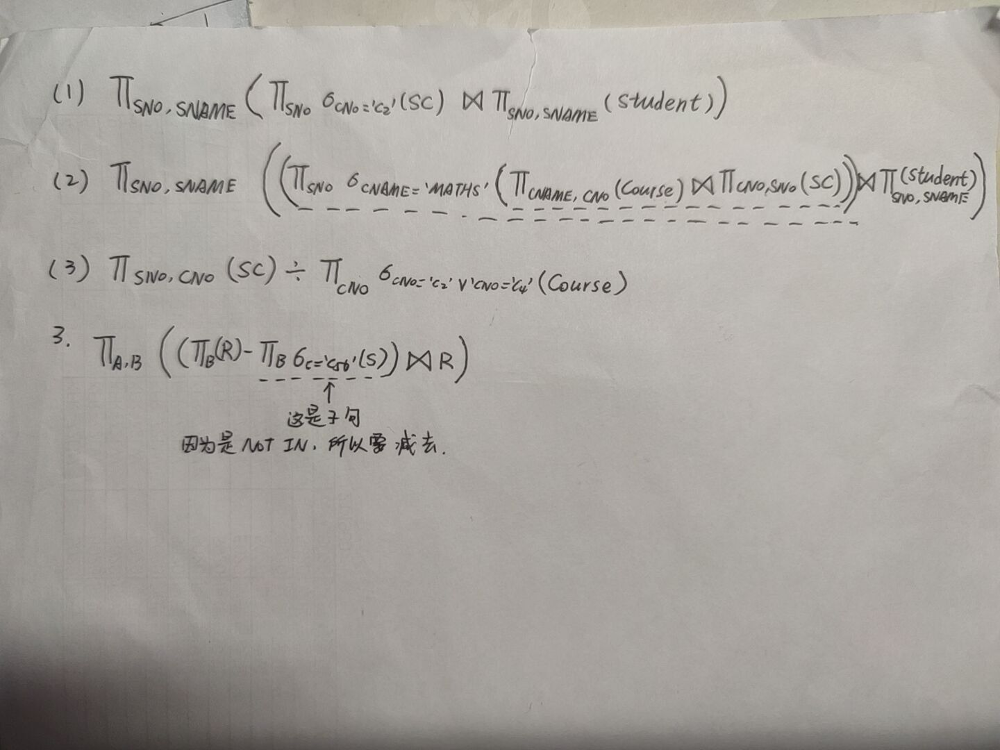

1、设有一个学生—课程数据库，其中关系表如下所示：

学生关系表：Student(Sno，Sname，Ssex，Sage，Sdept)，属性为：学生（学号，姓名，性别，年龄，所在系）

课程关系表：Course(Cno，Cname，Cpno，Ccredit)，属性为：课程（课程号，课程名，先修课号，课程学分）

学生选课关系表：SC(Sno，Cno，Grade)，属性为：选课（学号，课程号，成绩）

用SQL语句实现下列各项：

（1）创建学生选课表SC。（4′）

```sql
CREATE TABLE SC (SNO CHAR,
                 CNO CHAR,
                 GRADE INT,
                 PRIMARY KEY(SNO,CNO),
                 FOREIGN KEY(SNO) REFERENCES STUDENT(SNO),
                 FOREIGN KEY(CNO) REFERENCES STUDENT(CNO)
);
```

（2）为学生—课程数据库中的SC建立索引，SC表按学号升序和课程号降序建索引。（2′）

```sql
CREATE UNIQUE INDEX MY_INDEX ON SC(SNO ASC,CNO DESC);
```

（3）创建视图：院系学生数，要求将所有院系学生人数列示出来。（3′）

```sql
CREATE VIEW MY_VIEW AS(
SELECT SDEPT,COUNT(*)
FROM STUDENT
GROUP BY SDEPT);
```

（4）查询年龄在20～23岁（包括20岁和23岁）之间的学生的姓名、系别和年龄。（2′）

```sql
SELECT SNAME,SDEPT,SAGE
FROM STUDENT
WHERE SAGE >= 20 AND SAGE <= 23;
```

（5）查询学生姓名中第2个字为”明”字的学生的姓名和学号。（3′）

```sql
SELECT SNAME,SNO
FROM STUDENT
WHERE SNAME LIKE '_明%';
```

（6）查询“化学系”学生没有选修的所有课程名。（3′）

```SQL
SELECT CNAME
FROM COURSE
WHERE CNO NOT IN
		(SELECT CNO 
		FROM STUDENT,SC
		WHERE STUDENT.SNO = SC.SNO AND
			SDEPT = '化学系');

SELECT CNAME
FROM COURSE
WHERE NOT EXISTS(
    SELECT *
    FROM SC,STUDENT
    WHERE COURSE.CNO = SC.CNO AND
    	SC.SNO = STUDENT.SNO AND
    	STUDENT.SDEPT = '化学系');
```

（7）查询选修了课程M01或者选修了课程M02的学生。（3′）

```SQL
SELECT *
FROM STUDENT
WHERE SNO IN
	(SELECT SNO 
	FROM SC
	WHERE CNO = 'M01' OR CNO = 'M02');
	
SELECT *
FROM STUDENT,SC
WHERE SC.SNO = STUDENT.SNO AND
	(SC.CNO = 'M01' OR SC.CNO = 'M02');
```

（8）将学生08001的年龄改为23岁。（2′）

```SQL
UPDATE STUDENT
SET SAGE = 23
WHERE SNO = '08001';
```

（9）查询每一课的间接先修课（先修课的先修课）。（3′）

```SQL
SELECT FIRST.CNO,SECOND.CPNO
FROM COURSE FIRST,COURSE SECOND
WHERE FIRST.CPNO = SECOND.CNO;
```

2、设有3个关系模式如题1所示，请用关系代数表达式完成下列各题。

（1）检索选修课程号为C2的学生学号与姓名。（3′）

（2）检索选修课程名为MATHS的学生学号与姓名。（3′） 

（3）检索至少选修课程号为C2或C4的学生学号。（4′）

3、设有两个关系R（A，B）和S（B，C），有下列SELECT语句

​			SELECT  A，B

​			FROM  R

​			WHERE  B  NOT  IN（SELECT  B

FROM  S

WHERE  C='C56'）；	

请写出与之等价的关系代数表达式。



