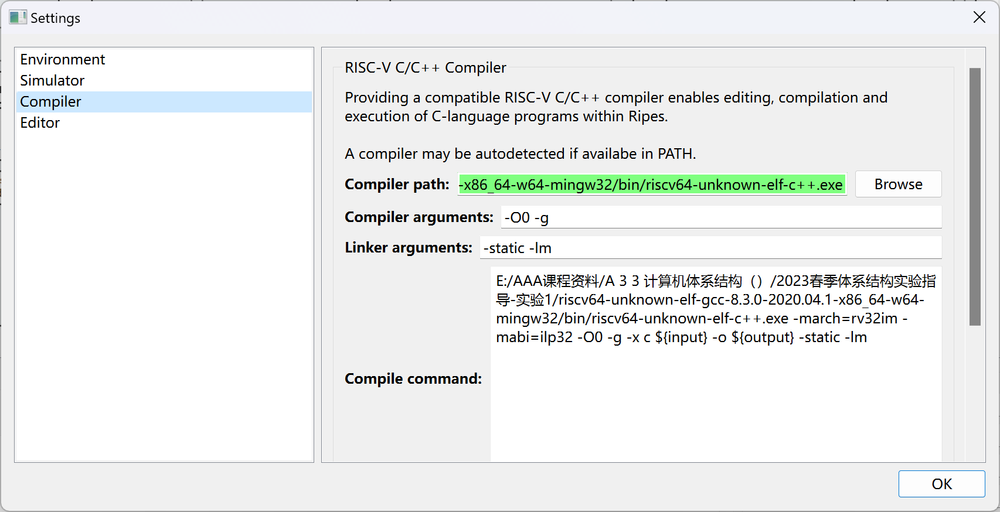
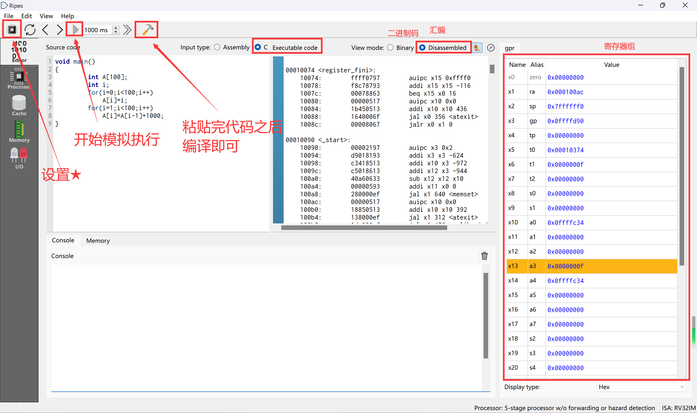
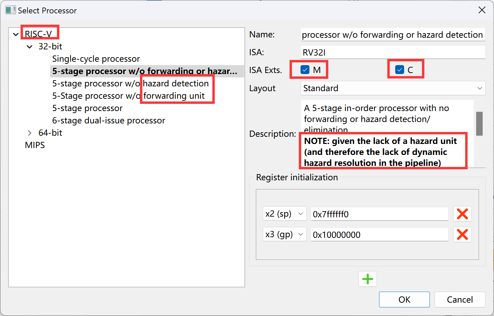
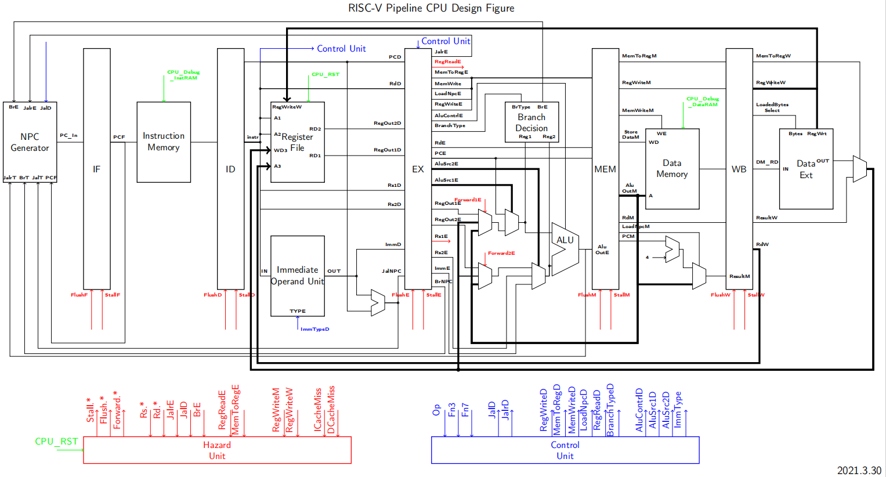
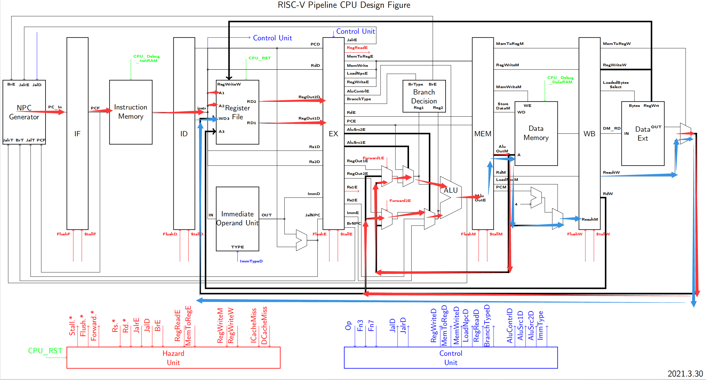
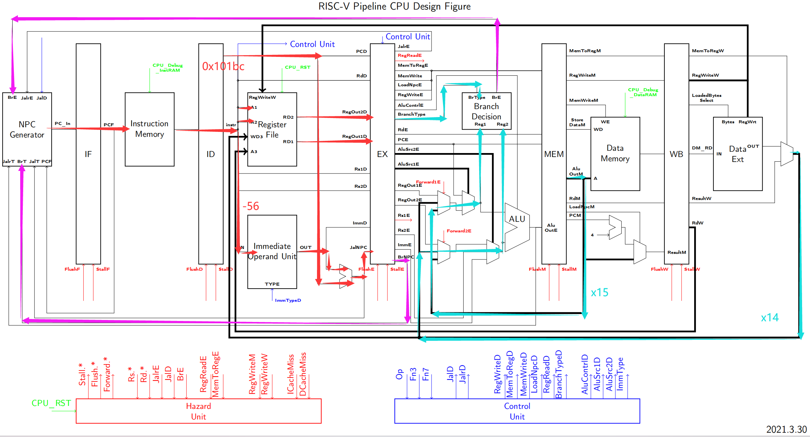
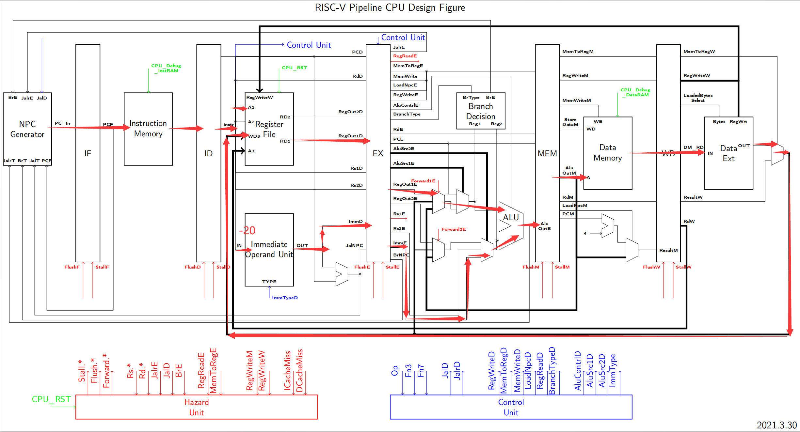
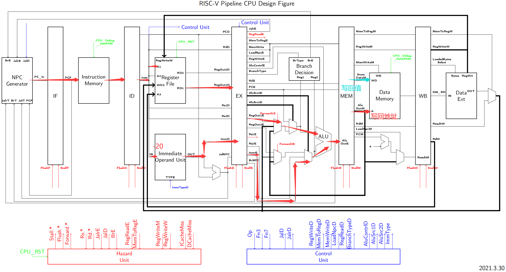
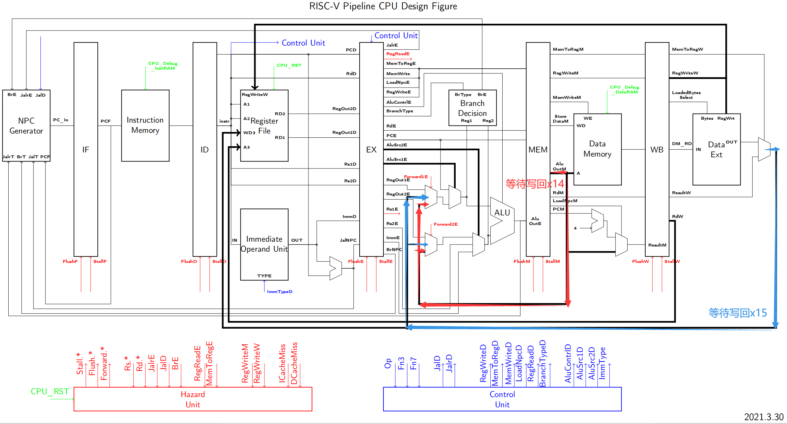

# 计算机体系结构 实验1

计科210X 甘晴void 202108010XXX

## 1 实验目的

参考提供为了更好的理解RISC-V，通过学习RV32I Core的设计图，理解每条指令的数据流和控制信号，为之后指令流水线及乱序发射实验打下基础。

参考资料：

- RISC-V 32I Core 设计图
- RISC-V 32I指令集
- A橙_ https://blog.csdn.net/Aaron503/article/details/130661248
- 芜湖韩金轮 https://blog.csdn.net/qq_51684393/article/details/131193067
- 指令集总结：https://suda-morris.github.io/blog/cs/riscv.html

## 2 实验过程

### 2.0 环境配置

安装模拟器Ripes，具体步骤见https://github.com/mortbopet/Ripes

已提供riscv32gcc编译器的ubuntu版本和windows版本。

该部分略去不表。

安装成功之后应该会有两个文件夹

- Ripes-v2.2.6-41-gb71f0dd-win-x86_64
- riscv64-unknown-elf-gcc-8.3.0-2020.04.1-x86_64-w64-mingw32

打开第一个文件夹内的Ripes.exe可以打开程序

打开settings呈现如下界面，若未设置好编译器环境，则中间的Compiler path呈现淡红色背景。单机Browse，编译器环境选择`/riscv64-unknown-elf-gcc-8.3.0-2020.04.1-x86_64-w64-mingw32/bin/riscv64-unknown-elf-c++.exe`。



下面是环境介绍



下面是配置介绍

左边可以选择芯片类型，以及流水线类型，可以看到这里覆盖支持五级流水线不同程度的forward（前推）和hazard（冒险处理），可以探索。

勾选C表示压缩指令集（建议不勾选C，指令会和蔼可亲一点）

这里貌似提示hazard并不是很支持。所以我还是用了最基础的5级流水线，然后目测的。



### 2.1 各部件介绍

采用这张RISC-V 32I Core设计图



布线理解：同名表示不同指令的同一信号/数据在同一时刻。如有RegWriteE，RegWriteM，RegWriteW，表示不同指令的RegWrite信号，为了避免同时出现在流水线图中造成混淆，故后缀E,M,W以示区分。

下面从左至右依次解读：

#### ①NPC Generator

下一条指令地址生成器

- BranchE：使能信号，指示Ex阶段的Branch指令是否确定跳转
- JalrE：使能信号，指示Ex阶段的Jalr指令是否确定跳转
- JalD：使能信号，指示ID阶段的Jal指令是否确定跳转
- PCF：旧的PC值（这里应该会自动自增4）
- JalrT：jalr指令的对应的跳转目标（相应使能信号使能时有效）
- BranchT：branch指令的对应的跳转目标（相应使能信号使能时有效）
- JalT：jal指令的对应的跳转目标（相应使能信号使能时有效）
- PC_in：产生的下一条指令，给流水线寄存器IF

#### ②Instruction Memory

指令内存

- PCF：读入的指令地址
- 输出：访存，找到指令传递给ID

#### ③Register File

寄存器堆，上升沿写入，异步读，x0始终为0

- RegWriteW：指示有写回操作
- A1：需取值的rs1寄存器编号（从指令解析来）
- A2：需取值的rs2寄存器编号（从指令解析来）
- RD1：取出rs1寄存器值
- RD2：取出rs2寄存器值
- A3：需写回的rd寄存器编号（由指令解析->RdD->RdE->RdM->RdW逐个传递而来）
- WD3：需写回rd寄存器的值

#### ④Immediate Operand Unit

立即数生成器，生成不同类型的32bit立即数

- IN：是指令除了opcode以外的部分编码值
- Type：表示立即数编码类型，全部类型定义在Parameters中
- OUT：表示指令对应的立即数32bit实际值

#### ⑤Branch Decision

跳转判断单元，根据控制信号BranchTypeE指定的分支类型，对操作数Operand1（Reg1）和Operand2（Reg2）进行比较并决定是否跳转，将判断结果通过BranchE输出

#### ⑥ALU

算数逻辑运算单元，接受Operand1和Operand2两个操作数，按照控制信号AluContrl执行对应的算术逻辑运算，将结果从AluOutE输出

#### ⑦Data Memory

- MemWriteM：使能状态表示写入，否则表示读出
- StoreDataM：写入的值
- AluOutM：写入的地址/读出的地址（由使能信号MemWriteM决定意义）
- 输出：取出的结果（MemWriteM非使能时）

#### ⑧Data Ext

- IN：是从Data Memory中load的32bit字
- LoadedBytesSelect：等价于AluOutM[1:0]，是读Data Memory地址的低两位，因为DataMemory是按字（32bit）进行访问的，所以需要把字节地址转化为字地址传给DataMem，DataMem一次返回一个字，低两位地址用来从32bit字中挑选出我们需要的字节
- RegWriteW：表示不同的寄存器写入模式，所有模式定义在Parameters中
- OUT：表示要写入寄存器的最终值


#### ⑨Hazard Unit

用于流水线冲突处理模块

- CpuRst: 外部信号，用来初始化CPU，当CpuRst1时CPU全局复位清零（所有段寄存器flush），Cpu_Rst0时cpu开始执行指令
- ICacheMiss, DCacheMiss：为后续实验预留信号，暂时可以无视，用来处理cache miss
- BranchE,JalrE,JalD: 控制相关处理信号
- Rs1D,Rs2D,Rs1E,Rs2E,RdE,RdM,RdW: 译码，执行，访存，写会阶段处理数据相关的信号，对应的源寄存器和目标寄存器号码。
- RegReadE: 标记A1和A2对应的寄存器值是否被用到。
- MemToRegE: 标志EX段从data mamory加载数据到寄存器
- RegWriteM,RegWriteW: 标记MEM段和WB段是否有目标寄存器写入操作。
  输出：
- StallF,FlushF: IF段插入气泡（维持状态不变）/冲刷（清零）
- StallD,FlushD: ID段插入气泡/冲刷
- StallE,FlushE: EX段插入气泡/冲刷
- StallM,FlushM: MEM段插入气泡/冲刷
- StallW,FlushW: WB段插入气泡/冲刷
- Forward1E,Forward2E: 定向路径控制信号

⑩Control Unit

控制信号模块

- Op：是指令的操作码部分
- Fn3：是指令的func3部分
- Fn7：是指令的func7部分
- JalD==1: 标志Jal指令到达指令ID译码阶段
- JalrD==1: 标志Jalr指令到达指令ID译码阶段
- RegWriteD: 表示指令ID译码阶段的寄存器写入模式
- MemToRegD==1: 标志ID阶段指令需要从data memory读取数据到寄存器
- MemWriteD: 共4bit，为1的部分有效，指示data memory的四个字节中哪些需要写入
- LoadNpcD: 标志将NextPC输出到ResultM
- RegReadD: 标志两个源寄存器的使用情况，RegReadD[1] == 1，表示A1对应的寄存器值被使用到了，RegReadD[0] == 1，表示A2对应的寄存器值被使用到了，用于forward处理
- BranchTypeD: 表示不同分支类型（参见BranchDecision部分）
- AluContrlD: 表示不同算数逻辑运算种类（参见ALU部分）
- AluSrc2D: Alu输入源Operand2的选择
- AluSrc1D: Alu输入源Operand1的选择
- ImmType: 立即数编码格式类型

### 2.2 生成汇编指令

提供的c代码

```c++
void main()
{
         int A[100];
         int i;
         for(i=0;i<100;i++)
             A[i]=i;
         for(i=1;i<100;i++)
             A[i]=A[i-1]+1000;
}
```

生成的汇编代码并分析：

生成的汇编代码较长，其主要标签有下面这些。

```bash
00010074 <register_fini>:
# 负责初始化和清理工作，比如在程序开始和结束时的初始化和收尾工作
00010090 <_start>:
# 程序入口，调用memset函数进行内存初始化，调用atexit函数注册程序退出时需要执行的函数
000100d0 <__do_global_dtors_aux>:
00010120 <frame_dummy>:
# 负责初始化和清理工作，比如在程序开始和结束时的初始化和收尾工作
00010144 <main>:
# 主函数，是主要研究对象
000101cc <atexit>:
# 程序退出时清理
000101e0 <exit>:
# 退出程序
00010214 <__libc_fini_array>:
# 结束时处理函数参数数组
00010274 <__libc_init_array>:
# 初始化函数参数数组
00010308 <memset>:
# 初始化内存
000103e4 <__register_exitproc>:
# 注册和调用退出处理函数
00010480 <__call_exitprocs>:
# 注册和调用退出处理函数
0001059c <_exit>:
# 终止程序的系统调用函数
000105e0 <__errno>:
# 存储错误码，在发生错误时可以查询该变量以获取错误信息
```

在这之中，我们主要研究与c代码有直接对应关系的main函数

```bash
00010144 <main>:
// main函数开始，建立栈帧
    10144:        7161            c.addi16sp -432
    10146:        1a812623        sw x8 428 x2
    1014a:        1b00            c.addi4spn x0 432
    
    
// 第一重循环
    1014c:        fe042623        sw x0 -20 x8			# i = 0
    10150:        a005            c.j 32				# 跳转至10170
    
    10152:        fec42783        lw x15 -20 x8			# i -> x15
    10156:        078a            c.slli x15 2			# 4*i -> x15
    10158:        ff040713        addi x14 x8 -16		# 与addr(A[0])有关 -> x14
    1015c:        97ba            c.add x15 x14			# 与addr(A[i])有关 -> x14
    1015e:        fec42703        lw x14 -20 x8			# i -> x14
    10162:        e6e7a623        sw x14 -404 x15		# x14 -> A[i]
    10166:        fec42783        lw x15 -20 x8			
    1016a:        0785            c.addi x15 1			
    1016c:        fef42623        sw x15 -20 x8			# 这三句完成i++
    10170:        fec42703        lw x14 -20 x8			# 判断部分
    10174:        06300793        addi x15 x0 99
    10178:        fce7dde3        bge x15 x14 -38		# i<100不成立，结束循环
    
    
// 第二重循环
    1017c:        4785            c.li x15 1			# 压缩指令，立即数1扩展后放入x15
    1017e:        fef42623        sw x15 -20 x8			# i = 1
    10182:        a80d            c.j 50				# 跳转至101b4
    
    10184:        fec42783        lw x15 -20 x8			# i -> x15
    10188:        17fd            c.addi x15 -1			# i-1 -> x15
    1018a:        078a            c.slli x15 2			# 4*(i-1) -> x15
    1018c:        ff040713        addi x14 x8 -16		# 与addr(A[0])有关 -> x14
    10190:        97ba            c.add x15 x14			# 与addr(A[i-1])有关 -> x15
    10192:        e6c7a783        lw x15 -404 x15
    10196:        3e878713        addi x14 x15 1000		# A[i-1]+1000 -> x14
    1019a:        fec42783        lw x15 -20 x8			# i -> x15
    1019e:        078a            c.slli x15 2			# 4*i -> x15
    101a0:        ff040693        addi x13 x8 -16		# 与addr(A[0])有关 -> x13
    101a4:        97b6            c.add x15 x13			# 与addr(A[i])有关 -> x15
    101a6:        e6e7a623        sw x14 -404 x15		# x14 -> A[i]
    101aa:        fec42783        lw x15 -20 x8
    101ae:        0785            c.addi x15 1
    101b0:        fef42623        sw x15 -20 x8			#这三句完成i++
    101b4:        fec42703        lw x14 -20 x8			# 判断部分
    101b8:        06300793        addi x15 x0 99
    101bc:        fce7d4e3        bge x15 x14 -56
    
// main函数结束，结束栈帧，返回调用者状态
    101c0:        0001            c.nop
    101c2:        1ac12403        lw x8 428 x2
    101c6:        615d            c.addi16sp 432
    101c8:        8082            c.jr x1
    101ca:        0000            c.addi4spn x0 0
```

注意到上述对于数组的访存有比较难以理解的地方如下：

```bash
10152:        fec42783        lw x15 -20 x8			# i -> x15
10156:        078a            c.slli x15 2			# 4*i -> x15
10158:        ff040713        addi x14 x8 -16		# 与addr(A[0])有关 -> x14
1015c:        97ba            c.add x15 x14			# 与addr(A[i])有关 -> x14
1015e:        fec42703        lw x14 -20 x8			# i -> x14
10162:        e6e7a623        sw x14 -404 x15		# x14 -> A[i]
```

以该点为例，我们知道`-20+x8`储存着i，那么它访问`A[i]`的方式实际上是这样：`-404 + x8-16 + 4*i`，最终访问的是`-420 + x8 + 4*i`，我们可以知道`-420 + x8`这个位置实际上就是`A[0]`。

但由于按照这种方式，`addi x14 x8 -16`这类语句结束后，在`x14`中储存的实际上是一个与`A[0]`有关的量，但并没有很明确的实体指代，故注释只能这样写。

### 2.3 问题解答

找出循环`A[i]=A[i-1]+1000;`对应的汇编代码

根据以上分析，该句对应的汇编代码如下：

```bash
// 第二重循环
    1017c:        4785            c.li x15 1			# 压缩指令，立即数1扩展后放入x15
    1017e:        fef42623        sw x15 -20 x8			# i = 1
    10182:        a80d            c.j 50				# 跳转至101b4
    
    10184:        fec42783        lw x15 -20 x8			# i -> x15
    10188:        17fd            c.addi x15 -1			# i-1 -> x15
    1018a:        078a            c.slli x15 2			# 4*(i-1) -> x15
    1018c:        ff040713        addi x14 x8 -16		# 与addr(A[0])有关 -> x14
    10190:        97ba            c.add x15 x14			# 与addr(A[i-1])有关 -> x15
    10192:        e6c7a783        lw x15 -404 x15
    10196:        3e878713        addi x14 x15 1000		# A[i-1]+1000 -> x14
    1019a:        fec42783        lw x15 -20 x8			# i -> x15
    1019e:        078a            c.slli x15 2			# 4*i -> x15
    101a0:        ff040693        addi x13 x8 -16		# 与addr(A[0])有关 -> x13
    101a4:        97b6            c.add x15 x13			# 与addr(A[i])有关 -> x15
    101a6:        e6e7a623        sw x14 -404 x15		# x14 -> A[i]
    101aa:        fec42783        lw x15 -20 x8
    101ae:        0785            c.addi x15 1
    101b0:        fef42623        sw x15 -20 x8			#这三句完成i++
    101b4:        fec42703        lw x14 -20 x8			# 判断部分
    101b8:        06300793        addi x15 x0 99
    101bc:        fce7d4e3        bge x15 x14 -56
```

思考以下问题：

对于a-d，（x是指以x开头的通用寄存器），写出该指令在流水线五个阶段（IF、ID、EX、MEM和WB）关键的控制信号（参考RISC V电路设计图），并通过分析指出数据通路。

#### a) 分析指令add x15, x14, x15

`c.add x15 x14`这条指令的`c.add`为压缩指令，含义与`add x15, x14, x15`相同

该指令的上下文摘录如下：

```bash
    10184:        fec42783        lw x15 -20 x8			# i -> x15
    10188:        17fd            c.addi x15 -1			# i-1 -> x15
    1018a:        078a            c.slli x15 2			# 4*(i-1) -> x15
    1018c:        ff040713        addi x14 x8 -16		# 与addr(A[0])有关 -> x14
    10190:        97ba            c.add x15 x14			# 与addr(A[i-1])有关 -> x15
```

##### ①IF阶段

由于该局部前面指令均无分支或跳转，故正常PC+4，取到10190。

★ JalrE,JalE,BrE均为非使能状态。

##### ②ID阶段

A1=0xe，A2=0xf，分别从RD1和RD2取出x14和x15的值，通过RegOut1D和RegOut2D传递给ID/EX流水线寄存器。

★此步骤的RegWriteW为前面指令的写入信号，应该是`c.addi x15 -1`该条指令的写入寄存器信号，由于该条指令需要写回x15，故应该是使能状态。对于本条指令来说，没有重要的控制信号。

##### ③EX阶段

从流水线寄存器中取出的值通过RegOut1E和RegOut2E传递给ALU前的MUX。

此时`HazardUnit`发现这里需要的x14和x15寄存器的值是前两条指令尚未成功写回reg储存的（具体机理尚待探明），于是通过forward信号选择数据前推的结果，以保证最新值。

此时来自RegOut1E和RegOut2E的值被舍去了。

★ 关键控制信号如下：

- Forward1E：选择MEM阶段前推的值（x14）作为寄存器读取值
- ForWard2E：选择WB阶段前推的值（x15）作为寄存器读取值
- AluSrc1E、AluSrc2E：都选择寄存器的值
- AluContrlD：ADDOP信号，ALU进行加法运算

##### ④MEM阶段

本操作与指令地址无关，故只需要给ResultM传递ALU的运算结果即可。

★ 关键控制信号如下：

- MemWriteM：非使能状态
- LoadNPCM：非使能，选择ALU运算结果传递到写回阶段

##### ⑤WB阶段

★ 关键控制信号如下：

- RegWriteW：使能状态
- MemToRegW：非使能状态，选择ALU运算结果

##### ⑥全过程数据通路

用红色表示路径进入ALU前的数据通路，从ALU出来进入MEM后改用蓝色表示存回Reg的路径。



#### b) 分析指令bge  x15, x14, -56

该指令的上下文摘录如下：

```bash
    101ae:        0785            c.addi x15 1
    101b0:        fef42623        sw x15 -20 x8			#这三句完成i++
    101b4:        fec42703        lw x14 -20 x8			# 判断部分
    101b8:        06300793        addi x15 x0 99
    101bc:        fce7d4e3        bge x15 x14 -56
```

##### ①IF阶段

由于该局部前面指令均无分支或跳转，故正常PC+4，取到101bc。

★ JalrE,JalE,BrE均为非使能状态。

##### ②ID阶段

A1=0xf，A2=0xe，分别从RD1和RD2取出x15和x14的值，通过RegOut1D和RegOut2D传递给ID/EX流水线寄存器。

同时，在ID右下方的ALU中取PCD值，与经过立即数符号扩展的-56进行加和，传给ID/EX流水线寄存器。

##### ③EX阶段

同样，这里需要的x15和x14寄存器的值都在前两条指令刚刚被更新过，故仍然需要forward进行前推。具体流程与之前的那一条指令类似。

★ 关键控制信号如下：

- Forward1E：选择MEM阶段前推的值作为寄存器读取值
- ForWard2E：选择WB阶段前推的值作为寄存器读取值
- AluSrc1E、AluSrc2E：都选择寄存器的值
- BrType，BrE：bge类型分支，比较两个操作数的值，如果op1>=op2，BrE使能，应该进行跳转，否则不应该跳转

在该阶段有4种可能

| 预测   | 事实               | 策略                                                         |
| ------ | ------------------ | ------------------------------------------------------------ |
| 跳转   | 满足分支条件，跳转 | harzard部件产生flush信号，冲刷流水线，bge指令的下一条指令无效。取指结果为跳转目标。 |
| 跳转   | 不满足分支条件     | 重新取指                                                     |
| 不跳转 | 满足分支条件，跳转 | 在EX阶段将跳转目标写入NPC                                    |
| 不跳转 | 不满足分支条件     | 继续正常执行                                                 |

下面假设预测不跳转但满足分支条件需要跳转，并继续进行。

##### ④MEM阶段

★ 关键控制信号如下：

- MemWriteM：非使能状态
- LoadNPCM：不写入，因此选择任意数据都没有影响，视为默认非使能
- RegWriteW：非使能状态，不写入
- MemToRegW：无影响

##### ⑤WB阶段

该指令无该阶段。

##### ⑥全过程数据通路（假设预测不跳转但实际跳转）

红色表示至EX阶段之前的数据通路，绿色表示在EX阶段通过前推方式得到x14和x15的值并使用BranchDecision计算分支是否成立，粉红色表示BrE使能信号和BrT跳转值传递给NPC Generator。




#### c) 分析指令lw x15, -20 x8

该指令有多条，选择其中一条，其上下文摘录如下：

```bash
    101a4:        97b6            c.add x15 x13			# 与addr(A[i])有关 -> x15
    101a6:        e6e7a623        sw x14 -404 x15		# x14 -> A[i]
    101aa:        fec42783        lw x15 -20 x8
```

##### ①IF阶段

由于该局部前面指令均无分支或跳转，故正常PC+4，取到101aa。

★ JalrE,JalE,BrE均为非使能状态。

##### ②ID阶段

A1=0x8，取x8寄存器值，通过RegOut1D传给ID/EX流水线寄存器，

同时，立即数-20通过立即数扩展单元扩展后直接通过ImmD传给ID/EX流水线寄存器。

★ 该阶段由于使用到了立即数扩展，ImmTypeD为相应的立即数类型

##### ③EX阶段

执行阶段，操作数1选择从寄存器中读取的x8的值，操作数2选择立即数的值，运算类型为加法，将结果传递到访存阶段。这里寄存器的值都是最新的，不需要通过前推来获取最新值。

★ 关键控制信号如下：

- Forward1E：选择寄存器读取的值
- ForWard2E：无影响
- AluSrc1E、AluSrc2E：OP1选择寄存器的值，OP2选择立即数
- AluContrl：ADDOP信号，加法运算

##### ④MEM阶段

将ALU运算的结果作为地址从存储器中读取值，传递给写回阶段。

- LoadNPCM：无影响，从存储器读取数据
- MemWriteM：非使能，读取数据

##### ⑤WB阶段

将访存结果传给寄存器组，写入寄存器x15

- RegWriteW：使能状态，写入寄存器
- MemToRegW：使能状态，选择访存结果

##### ⑥全过程数据通路




#### d) 分析指令sw x15, -20 x8

该指令有多条，选择其中一条，其上下文摘录如下：

```bash
    101aa:        fec42783        lw x15 -20 x8
    101ae:        0785            c.addi x15 1
    101b0:        fef42623        sw x15 -20 x8			#这三句完成i++
```

##### ①IF阶段

由于该局部前面指令均无分支或跳转，故正常PC+4，取到101b0。

★ JalrE,JalE,BrE均为非使能状态。

##### ②ID阶段

A1=0x8，取x8寄存器值，通过RegOut1D传给ID/EX流水线寄存器，

同时，立即数-20通过立即数扩展单元扩展后直接通过ImmD传给ID/EX流水线寄存器。

★ 该阶段由于使用到了立即数扩展，ImmTypeD为相应的立即数类型

##### ③EX阶段

执行阶段，操作数1选择从寄存器中读取的x8的值，操作数2选择立即数的值，运算类型为加法，将结果传递到访存阶段。这里寄存器的值都是最新的，不需要通过前推来获取最新值。

★ 关键控制信号如下：

- Forward1E：选择寄存器读取的值
- ForWard2E：无影响
- AluSrc1E、AluSrc2E：OP1选择寄存器的值，OP2选择立即数
- AluContrl：ADDOP信号，加法运算

##### ④MEM阶段

- LoadNPCM：无影响
- MemWriteM：写使能，写入数据

##### ⑤WB阶段

- RegWriteW：非使能状态，不需要写入寄存器

##### ⑥全过程数据通路




#### e) 简述BranchE信号的作用。

BranchE信号是指令执行(EX)阶段的一个控制信号，简写为BrE。用于判断是否需要进行分支跳转。

在流水线的EX阶段，若指令是分支指令，例如beq、bge等，即进行如下流程：

BrTypeD告知BranchDecision分支判断操作码类型，由BranchDecision对两个操作数rs1和rs2进行操作码所示的比较操作，若比较成立，则BrE信号将被设置为1，表示需要进行分支跳转。

同时，BrNPC（即BrT）将跳转地址传回NPC Generator。

此时由NPC Generator根据BrE使能来决定是否采用BrT的值作为下一个指令地址。


#### f) NPC Generator 中对于不同跳转 target 的选择有没有优先级？如果有，请举例并分析。如果没有，请解释原因。

NPC Generator有四种可选的下一条指令值：

- PC+4：默认执行下一条指令
- BrT：分支跳转地址，由BrE使能
- JalT：无条件跳转地址，目标地址为PC+Imm，在ID阶段计算，由JalD使能
- JalrT：无条件相对跳转地址，目标地址为寄存器的值设置最低位为0，在EX阶段计算，由JalrE使能

只要BrE,JalD,JalrE其一为真，就不使用PC+4作为下一地址。

Jalr 指令的目标地址在EX阶段才由ALU计算出，Jal 指令的目标地址则是在ID阶段可以直接得出，而Branch的验证也在Ex阶段通过比较才得出。相应地，BrE和JalrE在EX阶段才能给出，而JalD在ID阶段就给出了。故实际上NPC Generator在同一时刻接收到的BrE,JalD,JalrE并不是来自同一条指令的意愿。同一时刻，NPC Generator接收到的BrE和JalrE是相较于JalD早一条的指令的跳转意愿，也是应该先被考虑的。因此在使能信号的处理上，对于JalrE和BrE的优先级高于JalD。

脱离本题本电路，从另一个角度看。若在本电路上进行修改，使得Br,Jal,Jalr均在EX段跳转，则不会有冲突，该种情况下不需要设置优先级。


### 2.4 附加思考题

#### 1 Harzard模块中，有哪几类冲突需要插入气泡（NOP指令），分别使流水线停顿几个周期。（提示：有三类冲突）

总共有3类冲突，产生的原因如下：

- 结构冲突：部件在一个周期只能执行一个任务，指令存储和数据存储需要分离，否则会产生同时访问数据存储和指令存储的冲突问题。【但由于RISC-V的指令和数据是分离存储的，故不需要考虑这个问题】
- 数据冲突：RAW,WAR,WAW，前后读写间有顺序依赖，如果要改变指令之间的相对顺序可能导致问题。
- 控制冲突：预测失误，已经执行了两条跳转或不跳转后的指令

这3类冲突的解决方式如下：

- 结构冲突：重排，stall，Duplicate（重复拷贝）【RISC-V没有结构冲突】
- 数据冲突：stall（停顿），指令重排（软件介入），转发（硬件支持）。
- 控制冲突：flush，预测（成立或不成立），延迟跳转

针对本实验中的Harzard模块以及遇到的问题，分析如下：

- RAW类冲突：如Load和ALU指令，在ALU计算时，操作数还未读出来。在EX段Stall，使流水线停顿1个周期
- 控制相关的冲突：如在跳转时，需要插入气泡，flush掉IF段取的指令，停顿1个周期
- 条件转移的冲突：在条件转移时，需要插入气泡，flush掉IF，ID段取的指令，停顿2个周期

举例如下：

##### （1）可以使用forward进行处理的

```bash
    1018a:        078a            c.slli x15 2			# 4*(i-1) -> x15
    1018c:        ff040713        addi x14 x8 -16		# 与addr(A[0])有关 -> x14
    10190:        97ba            c.add x15 x14			# 与addr(A[i-1])有关 -> x15
```

在执行`add x15 x14`时需要用到`x14`和`x15`这两个寄存器的新值，而这两个寄存器分别在前一步和前两步被要求写入（实际上还没有写回reg），此时可以使用forward前推信号分别将`x14`和`x15`的新值放入ALU的两个入口，直接完成这一条指令。

**Harzard单元接收到RegWrite和RegRead信号同时为使能状态，并且源寄存器和写入目的寄存器相同时，就通过forward信号选择数据前推的结果**。

数据通路如下：




##### （2）无法使用forward进行处理的

```bash
lw x15 -20 x8
addi x14 x15 -16
```

由于在访存后，WB前没有将数据前推的通路以及控制信号。故这里没法让x15的新值提前流入ALU的入口。

此时**harzard单元收到MemToRegE为使能状态，rs寄存器和rd寄存器为同一个寄存器**，发现存在该冲突，发出stall信号，让执行阶段及之前的所有阶段暂停，而访存和写回阶段继续，只需要暂停一个周期，写回的结果就可以前推回执行周期，流水线就可以继续工作了。


##### 2 Harzard模块中，采用静态分支预测器，即默认不跳转，遇到branch指令时，如何控制flush和stall信号？

Branch指令在EX段判断。

如果发生分支，则需要Flush IF/ID和ID/EX段寄存器来保证数据不被后方指令错误使用，不需要设置Stall。

在此情况之外不需要设置flush或stall。
