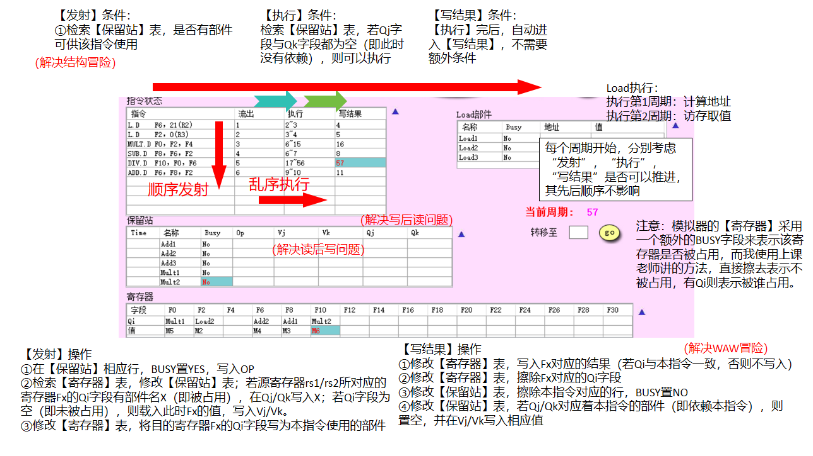

# 计算机体系结构 实验2

计科210X 甘晴void 202108010XXX

## 1 实验目的

熟悉Tomasulo模拟器同时加深对Tomasulo算法的理解，从而理解指令级并行的一种方式-动态指令调度。

掌握Tomasulo算法在指令流出、执行、写结果各阶段对浮点操作指令以及load和store指令进行什么处理；给定被执行代码片段，对于具体某个时钟周期，能够写出保留站、指令状态表以及浮点寄存器状态表内容的变化情况。

学习ScoreBoard和Tomasulo算法，并且进行Tomasulo算法的模拟实验，同时熟悉动态指令调度相关知识。

【注】由于老师之前花了三节课时间详细讲解了ScoreBoard和Tomasulo算法，故本实验实际上较为简单，主要是理解。

参考资料：

- Tomasulo算法模拟器使用方法.doc
- 芜湖韩金轮：https://blog.csdn.net/qq_51684393/article/details/134891988

## 2 实验过程

### 2.0 环境配置

本实验单独使用模拟器Tomasulo.exe，无其它环境配置问题。

### 2.1 基础知识

#### ①动态调度算法Tomasulo

主要与ScoreBoard差不多，不同点大致在将READ和EXE合并为一个EXE步骤，另外就是寄存器重命名（保留站只保留副本而不是寄存器本身），和广播机制。

我做了一个总结如下，按照这个操作基本上就能跑起来了。




下面是使用模拟器的教程。

#### ②设置指令和参数

指令种类

- L.D指令：从主存读取一个双精度浮点数；
- ADD.D：双精度浮点加法指令；
- SUB.D：双精度浮点减法指令；
- MULT.D：双精度浮点乘法指令；
- DIV.D：双精度浮点除法指令。

各指令执行时间

- 不同部件，尤其是浮点功能部件，它们的执行时间往往是不同的。特别是除法部件，往往要延迟很多周期。模拟器中可以设置这个时间。

复位

- 所有设置恢复默认值

#### ③执行

- 点击“执行”按钮，就进入执行状态。可以用中间的按钮来控制指令的执行，包括“步进”、“退1步”、“前进5个周期”、“后退5个周期”、“执行到底”、“退出”等。还可以用“go”按钮直接跳转到指定的时钟周期。
- 如果想修改被执行的代码，按“退出”按钮，即可回到设置指令和参数页面。
- 向前执行后，状态表中抹色的字段表示其内容发生了变化。

#### ④对比状态表

- 每一个状态表的右上角外侧都有一个小三角，用鼠标左键点击它，会弹出该表在上一个时钟周期的内容。
- 在弹出表以外的区域再次点击鼠标，就可以将其收回。

#### ⑤各表内容

【指令状态表】列出了各指令什么时候执行到了哪一步。其中的数字表示时钟周期，“~”表示时钟周期期间。

【保留站】给出了各执行部件是否被占用，以及其在该时刻的寄存器依赖信息（是在执行？还是因为哪个寄存器而不能执行？）。其中各字段的名称和含义如下：

- Time：表示相应的保留站还有要执行多少个时钟周期；
- 名称：保留站的名称。用于唯一地标识相应的保留站；
- Op：要对源操作数进行的操作；
- Qj，Qk：将产生源操作数的保留名称。等于0表示操作数已经就绪且在Vj或Vk中，或者不需要操作数。
- Vj，Vk：源操作数的值。对于每一个操作数来说，V或Q字段只有一个有效。
- Busy：为“Yes”表示该保留站 “忙”。

【Load部件】按队列方式工作，每次处理新的访存都是从队列头部取走一条。其中各字段的含义如下：

- 名称：相应单元的名称（标识）；
- Busy：“忙”标志，为“Yes”表示已被占用；
- 地址：访存的有效地址；
- 值：存放从存储器读来的数据。

【寄存器】指明此时寄存器是否被指令占用（需要写回），以及此时的值。该缓冲器各字段的含义如下：

- 【请注意】这里指导手册上写的是有问题的，与课堂上老师讲的不同，这里有一个BUSY字段比较隐晦难以看到。Qi表示将把结果写入该寄存器的保留站的站号，BUSY字段表示是否被占用。老师上课讲的是，指令写回后擦除Qi字段，但是这个模拟器是把BUSY置空即可，相当于擦除了Qi。也即：只有BUSY为被占用，Qi才有效。
- Qi：寄存器状态，用于存放将把结果写入该寄存器的保留站的站号。
- 值：寄存器的值。
- BUSY：是否被占用。为空则表示当前没有正在执行的指令要写入该寄存器，也即该寄存器中的内容就绪。

最下面，把上面两个值压缩一下，就会出现BUSY字段（这个UI界面怎么这么糟糕）


当上述表中的内容写不下时，模拟器会采用缩写的方法。这时，在上面中间的区域中会显示缩写及其值。


### 2.2 模拟算法，回答问题

使用模拟器进行以下指令流的执行并对模拟器截图、回答问题

```bash
L.D   F6, 21（R2）
L.D   F2, 0 （R3）
MUL.D  F0, F2, F4
SUB.D  F8, F6, F2
DIV.D  F10,F0, F6
ADD.D  F6, F8, F2
```

假设浮点功能部件的延迟时间：加减法2个周期，乘法10个周期，load/store2个周期，除法40个周期。

设置如下：


问题如下：

- 分别截图（当前周期2和当前周期3），请简要说明load部件做了什么改动
- 请截图（MUL.D刚开始执行时系统状态），并说明该周期相比上一周期整个系统发生了哪些改动（指令状态、保留站、寄存器和Load部件）
- 简要说明是什么相关导致MUL.D流出后没有立即执行
- 请分别截图（15周期和16周期的系统状态），并分析系统发生了哪些变化
- 回答所有指令刚刚执行完毕时是第多少周期，同时请截图（最后一条指令写CBD时认为指令流执行结束）

#### 问题1

> 分别截图（当前周期2和当前周期3），请简要说明load部件做了什么改动

当前周期2


第一条Load指令进入执行1阶段，计算出`R[R2]+21`并保存在Load1的寄存器中。

第二条Load指令发射，分配使用Load2部件，Busy位置Yes。

当前周期3


第一条Load指令进入执行2阶段，访存并获得`M[R[R2]+21]`，保存在Load1部件的值寄存器中。

第二条Load指令进入执行1阶段，计算出`R[R3]+0`并保存在Load2的寄存器中。


#### 问题2

> 请截图（MUL.D刚开始执行时系统状态），并说明该周期相比上一周期整个系统发生了哪些改动（指令状态、保留站、寄存器和Load部件）

MULT.D开始执行前一步的系统状态


MULT.D开始执行时的系统状态


下面比较指令状态、保留站、寄存器和Load部件发生的改动。

- 指令状态：由于MULT和SUB使用的部件不同，且该步没有寄存器相关的冲突（在前一步，也就是第5步，Load操作写回F2，解除了F2的依赖），故可以同时进入执行状态。又第6条ADD指令的写回寄存器F6刚被Load1指令释放，恰好可以被ADD指令使用，故ADD指令被发射。
- 保留站：主要是把ADD指令相关的信息写入部件ADD2，BUSY位置1，Op位为ADD，此时ADD需要F2和F8的值，但是F8此时还被前面的SUB指令（ADD1部件）占用（寄存器中F8的Qi字段为ADD1），故Vj空置，Qj写入Add1，由于F2此时已经被释放，Vk可以写入F2的对应值M2（具体问题能算出M2的具体数值，但这里直接给了个未知数代替，是一样的）
- 寄存器：ADD的目的地址是F6，故F6的Qi字段写入F6.
- Load部件：该两部未发生访存，也没有Load指令在执行，故无事发生。


#### 问题3

> 简要说明是什么相关导致MUL.D流出后没有立即执行

简单来说，MULT.D依赖的F2寄存器直到第5周期才被Load2指令写回，故MULT.D只能在第6周期进入执行阶段。

MULT.D指令在第3步流出（即被发射），

目的寄存器是F0，写入【寄存器】部件，

其源寄存器分别是F2和F4，查表【寄存器】部件，发现F2此时被Load2部件占用，将这一信息写入【保留站】中，即Qj字段，

那么只有在F2的占用结束时，MULT.D才能执行。


#### 问题4

> 请分别截图（15周期和16周期的系统状态），并分析系统发生了哪些变化

第15周期


第16周期


该两步主要聚焦MULT结束它漫长的执行周期后发生的事情。

主要是两件事情：释放部件，更新保留站。

第15周期，MULT结束了它的执行。第16周期，MULT写回F0的结果。并释放自己占用的MULT1部件。同时系统检索整个【保留站】，并释放所有在Qj或Qk字段被打上【因为MULT1部件，而不能执行】的这些行，在vj或vk补上F0的结果。

事实上，这里的DIV指令在第5周期被发射之后，就一直在等待F0被解除占用，现在在第16周期，终于由于MULT更新F0值解除了占用。

下一周期，第17周期，DIV指令进入执行阶段。


#### 问题5

> 回答所有指令刚刚执行完毕时是第多少周期，同时请截图（最后一条指令写CBD时认为指令流执行结束）

所有指令刚刚执行完毕是第57周期。DIV.D指令在第56周期被执行完毕，在第57周期被写回。


### 2.3 思考题

#### 问题1

> Tomasulo算法相比Score Board算法有什么异同？（简要回答两点：1.分别解决了什么相关问题，2.两者分别是分布式还是集中式）

分别解决的问题

- Tomasulo算法和Scoreboard算法都解决了指令级并行处理器中的数据相关性问题。
- Tomasulo算法通过寄存器重命名和乱序执行技术更有效地解决了数据相关性，允许指令乱序执行，提高了并行度和吞吐量。
- Scoreboard算法通过中心化的控制单元管理指令的发射和执行，依赖于指令执行的严格顺序，处理数据相关性。

分布式与集中式

- Tomasulo算法是一种**分布式**的指令调度算法，每个执行单元都具有独立的调度器，能够并行地调度指令，处理器中各个部分之间通过共享总线或其他通信方式进行通信。
- Scoreboard算法是一种**集中式**的控制方法，通过中心化的控制单元管理指令的发射和执行，指令的执行顺序由中心控制器决定，整个处理器的调度是由中心控制器统一管理的。

为什么Tomasulo比ScoreBoard效率更高：

①ScoreBoard存在结构冲突，未使用定向技术

②Tomasulo的WAW和WAR不需要stall，而scoreboard需要检测与stall


#### 问题2

> Tomasulo算法是如何解决结构冒险、RAW、WAR和WAW相关的数据冒险？

Tomasulo算法通过以下3个方法解决数据相关性引起的结构冒险、RAW、WAR和WAW相关的数据冒险：

- **寄存器重命名（Register Renaming）**：Tomasulo算法使用物理寄存器来存储指令操作数的结果，而不是使用程序中的逻辑寄存器。这样，即使多个指令试图同时写入相同的逻辑寄存器，也不会导致WAR和WAW相关。每个操作数都与一个唯一的物理寄存器相关联，从而避免了数据冒险。（即取了副本而不是寄存器本身）
- **乱序执行（Out-of-order Execution）**：Tomasulo算法允许指令按照它们的操作数可用性而不是它们在程序中的顺序来执行。这种乱序执行可以有效地解决RAW相关，因为当一个指令的操作数可用时，它就可以立即执行，而不必等待前面的指令。（这一点ScoreBoard也做到了）
- **数据依赖检测（Data Dependency Checking）**：Tomasulo算法中的每个执行单元都会检查指令的操作数是否已经准备好。如果操作数还未准备好，执行单元将等待，直到相关的操作数变为可用。

通过这些技术，Tomasulo算法能够在执行指令时动态地解决结构冒险、RAW、WAR和WAW相关的数据冒险，从而提高了指令级并行处理器的性能和效率。

下面我给出具体示例来说明。

##### 读后写（WAR）冒险


##### 写后读（RAW）冒险


##### 写后写（WAW）冒险


【更进一步讨论极端情况】若两条WAW之间有需要读取F10，第一个W写完之后要更新【保留站】内的逻辑寄存器，但不更新回【寄存器】表内的物理寄存器，因为它已经被后一个W给锚定了。

## 3 实验总结

本次实验中，我深入研究了动态指令调度算法以及其在指令级并行处理器中的优化应用。通过对Tomasulo算法和相关概念的探索，我得以更全面地理解现代处理器如何通过动态指令调度来提高性能，并在模拟环境中进行了实际操作和观察。

- **算法原理的理解与应用：** 通过实验，我对Tomasulo算法及其在处理器设计中的作用有了更深入的理解。该算法通过寄存器重命名、乱序执行和指令调度等技术，有效解决了数据相关和控制相关问题，实现了指令级并行，从而提高了处理器的吞吐量和性能。
- **模拟实验的操作与观察：** 通过使用Tomasulo模拟器，我能够模拟指令的执行过程，观察指令之间的依赖关系和执行顺序，以及调度单元的工作状态。这些实际操作让我更直观地理解了动态指令调度算法的实际应用，以及在不同场景下的性能表现。
- **理论与实践相结合的学习：** 这次实验不仅强调理论知识的学习，更注重将理论知识应用于实际情境的实践。通过理论分析和模拟实验相结合的方式，我不仅学会了算法的原理，还能够将其应用于实际的处理器设计中，从而更好地理解和掌握动态指令调度的核心思想和实现方式。
- **深化对处理器性能优化的认识：** 通过这次实验，我进一步认识到动态指令调度在处理器性能优化中的重要性。优秀的动态指令调度算法能够有效地提高处理器的并行度和吞吐量，从而加速程序的执行，提升系统的整体性能。

通过本次实验，我不仅加深了对动态指令调度算法的理解，还学会了如何将其应用于指令级并行处理器的优化设计中。这为我今后在计算机体系结构和并行计算领域的学习和研究提供重要的理论基础和实践经验。
