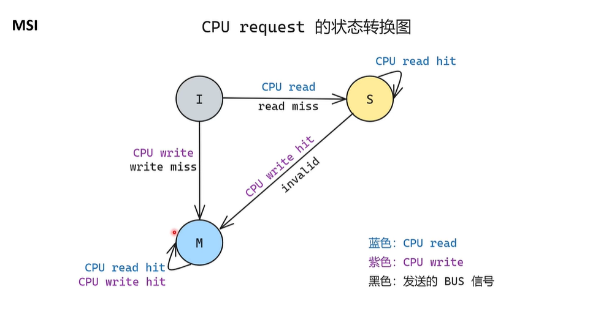
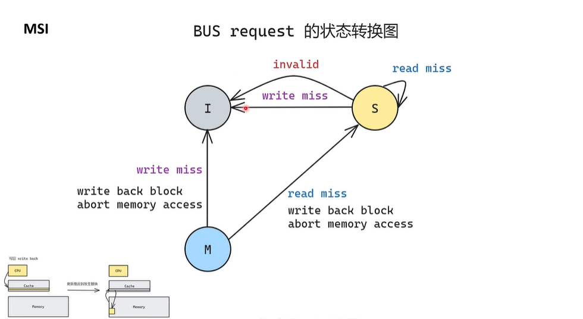
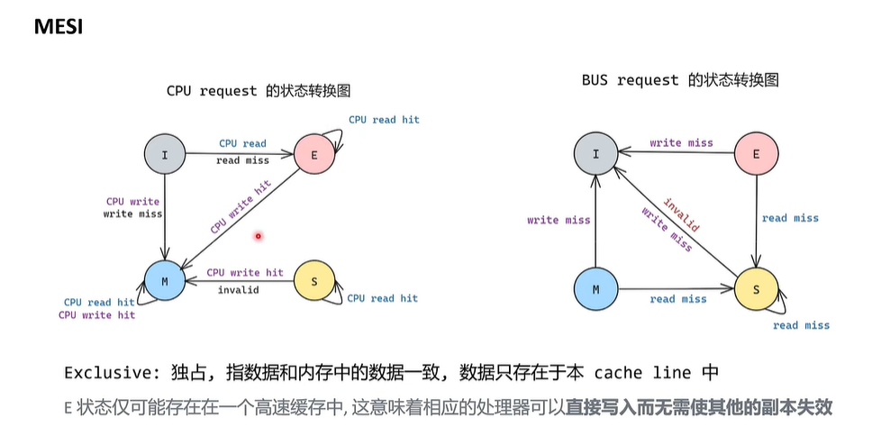
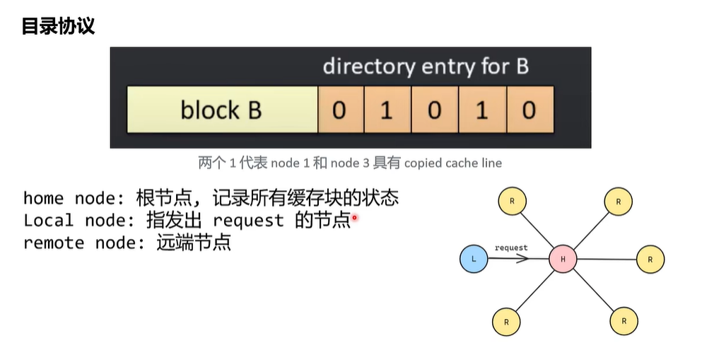
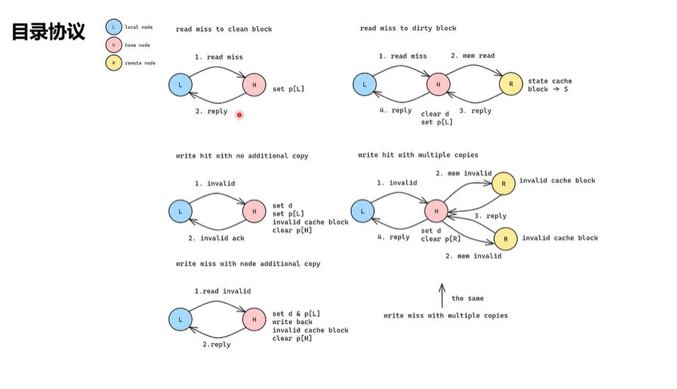
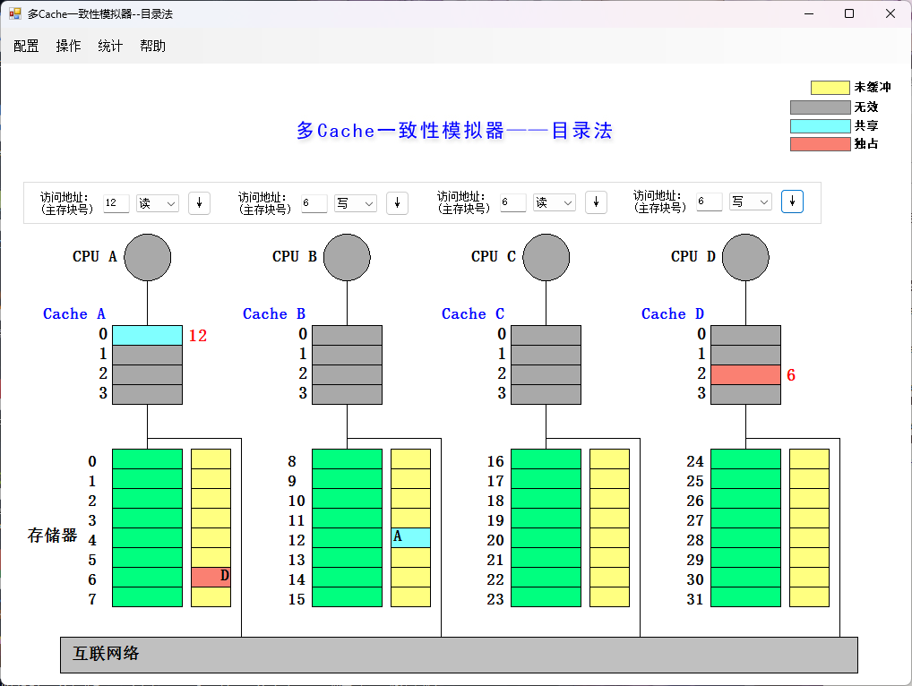
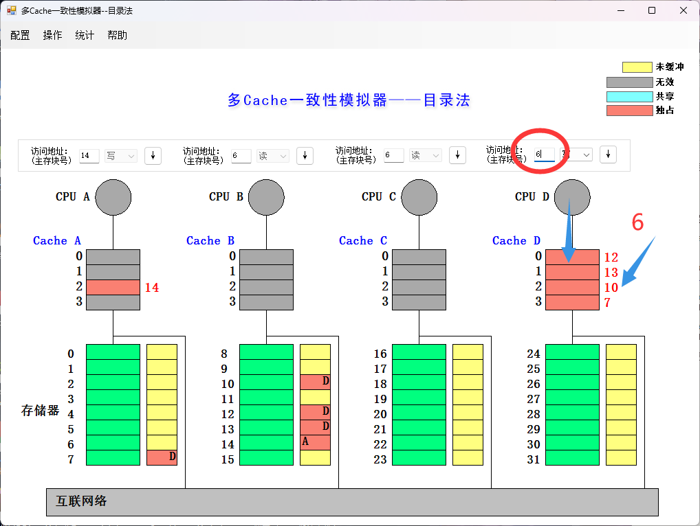
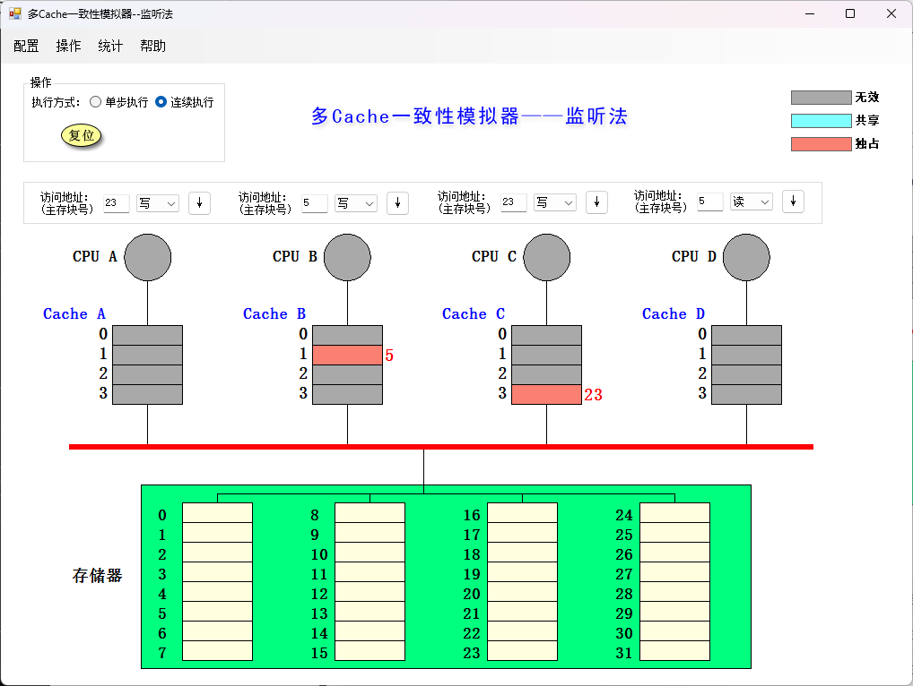

# 计算机体系结构 实验3

计科210X 甘晴void 202108010XXX

[TOC]

## 1 实验目的

熟悉cache一致性模拟器（监听法和目录法）的使用，并且理解监听法和目录法的基本思想，加深对多cache一致性的理解。

做到给出指定的读写序列，可以模拟出读写过程中发生的替换、换出等操作，同时模拟出cache块的无效、共享和独占态的相互切换。

参考资料：

- 【强烈推荐】https://www.bilibili.com/video/BV1iA4m137Xr
- 【经典A橙】https://blog.csdn.net/Aaron503/article/details/133985380

声明：部分讲解图片来源于B站up主[kami陆](https://space.bilibili.com/261543088)【技术杂谈】缓存一致性，总结的非常好，一看就看懂了。

## 2 实验过程

学习cache一致性监听法和目录法，并且进行一致性算法的模拟实验，同时熟悉相关知识。

### 2.0 预备知识

#### 2.0.1 多cache一致性算法——监听法

##### 2.0.1.1 MSI协议

- Modified	已修改：缓存中的数据和内存中的数据不一致，最新的数据只存在于当前的缓存块当中
- Shared        共享：缓存数据和内存中的一致
- Invalidated 已失效：该缓存块无效

每个块都有如下三种状态，由CPU对块的不同操作在如下状态图上跳转。

注意，read/write miss信号会指明块编号，监听时会对适当的块编号做出反应。

每个处理器上都有一个模块在总线上监听，并对接收到的信号（块编号一致）作出反应，进行如下跳转。

##### 2.0.1.2 MESI协议

相较于之前多了一个exclusive，解决重复步骤的问题。

##### 2.0.1.3 本题讲解 

本题的“占用”好像地位类似于上面的“已修改”，可以认为是基于MSI协议进行的。

#### 2.0.2 多cache一致性算法——目录法

##### 2.0.2.1 有中心的目录法

视频介绍的是一种有中心的目录法，它所有的块状态都存在中心结点上，更新时都需要与中心结点进行交互。这与我们的问题有一些差别，后面会提到，但是模式有相似之处。

##### 2.0.2.2 本题讲解

本题是一种去中心分布式的目录法，存储器分布式地存储在各个结点上（事实上，这样会更好）。与上面所给出的有一定区别。此外，本题还引入了独占(Exclusive)，接下来我来讲解本题的做法。

根据每一次的具体任务，会有三类结点（任务不一样，需要重新划分）

- 宿主H（记录我想要操作的这个缓存块目录的所在结点）
- 本地L（处理操作的CPU与Cache所在的结点）
- 远端R（其它与这个操作有关系的结点）

举例：如在上图中，此时在CPU-C上写块6，那么宿主结点是A，本地结点是C，远端结点是D。

下面是不存在替换的情况（即Cache的这个位置本来是空的，不会覆盖原有的）

- 读，命中：不做处理
- 写，命中：不做处理
- 读，不命中：
  - 与宿主结点H通信，若H的目录为【空】或【共享】，从H的存储器发数据给L，H的目录中标记【共享】L；本地L的Cache标记【共享】
  - 与宿主结点H通信，若H的目录为另一节点R【独占】，H先从R处取回数据，放在H存储器，从H的存储器发数据给L，H的目录中解除R【独占】，标记【共享】RL，本地L的Cache标记【共享】
- 写，不命中：
  - 与宿主结点H通信，若H的目录为【空】，从H的存储器发送数据给L，H的目录中标记【独占】L；本地L的Cache标记【独占】
  - 与宿主结点H通信，若H的目录为另一节点M【独占】，H发【作废】信号给M，M将该数据块送还给H，M的Cache标记为【作废】，取消掉这个块的存在，H再发数据给L，H的目录中解除M【独占】，添加L【独占】，L的Cache标记为【独占】
  - 与宿主结点H通信，若H的目录为另一两个R【共享】，H发【作废】信号给所有的R，所有的R将Cache标记为【作废】，并取消掉这个快的存在，H再发数据给L，H的目录中解除R的【共享】，添加L【独占】，L的Cache标记为【独占】

看下面这个例子，此时如果写入6，会覆盖掉10，此时在上面的步骤之前还要加一个写回与修改目录的操作。

写回并修改共享集：如上图中，L结点(D)向10所在的R‘结点(B)通信，把10的最新值传回去，并要求取消掉块10目录中的L【独占】标记。然后把L结点的Cache-2，即块10在的那块清空，此时情况转化为了上面的情况，可以按照前面列出来的例程处理。

总结：如果存在替换的情况，要先做写回并修改共享集。然后先跟宿主机H通信，确定是哪种情况，然后再做相应的操作。凡是写不命中，都是用【独占】解决，相当于在目录上开了个声明：“最新的副本在我这，想要的来问我要”。凡是读不命中，都用【共享】来解决。凡是要在目录中删除一项【独占】标记，都必须先把最新的副本拿回来，再删除。

### 2.1  cache一致性算法-监听法模拟

1） 利用监听法模拟器进行下述操作，并填写下表

【注意】

- 用I代表Invalidated，为“无效”
- 用S代表Shared，为“共享”
- 用E代表Exclusive，为“独占”
- 举例：A5:I->S表示A处理器上的块5原来标记“无效”，现在改为“共享”

| 所进行的访问   | 是否发生了替换？ | 是否发生了写回？ | 监听协议进行的操作与块状态改变 | 具体事件                                                     |
| -------------- | ---------------- | ---------------- | ------------------------------ | ------------------------------------------------------------ |
| CPU A 读第5块  | ×                | ×                | A5:I->S                        | 读不命中，发送读不命中信号，将块5从主存读入Cache A1          |
| CPU B 读第5块  | ×                | ×                | B5:I->S                        | 读不命中，发送读不命中信号，将块5从主存读入CacheB1           |
| CPU C 读第5块  | ×                | ×                | C5:I->S                        | 读不命中，发送读不命中信号，将块5从主存读入CacheC1           |
| CPU B 写第5块  | ×                | ×                | B5:S->E;   A5:S->I;   C5:S->I  | 写命中，让其他CPU的块5失效                                   |
| CPU D 读第5块  | ×                | √                | B5:E->S;   D5:I->S             | 读不命中，发送读不命中信号，CPUB接收到该信号，发送给CPUD块5，CPUD将块5读入CacheD1 |
| CPU B 写第21块 | √                | ×                | B5:S->I;   B21:I->E            | 写不命中，将块21写入CacheB1，替换块5，发送写失效信号         |
| CPU A 写第23块 | ×                | ×                | A23:I->E                       | 写不命中，将块23写入CacheA3，发送写失效信号                  |
| CPU C 写第23块 | ×                | √                | A23:E->I;   C23:I->E           | 写不命中，将块23写入CacheA3，发送写失效信号，CPUA将块写回主存 |
| CPU B 读第29块 | √                | ×                | B29:I->S                       | 读不命中，发送读不命中信号，将块29从主存读入CacheB1，替换掉块21 |
| CPU B 写第5块  | √                | ×                | B29:S->I;   B5:I->E;   D5:S->I | 写不命中，发送写不命中信号，将块5写入CacheB1，替换掉块29，块29为独占，先将其写回。写入块5后发送写失效信号 |

2） 请截图，展示执行完以上操作后整个cache系统的状态

### 2.2 cache一致性算法-目录法模拟

1） 利用目录法模拟器进行下述操作，并填写下表

| 所进行的访问   | 监听协议进行的操作                                           | 存储器块状态改变                    | Cache块状态改变                                              |
| -------------- | ------------------------------------------------------------ | ----------------------------------- | ------------------------------------------------------------ |
| CPU A 读第6块  | 读不命中，块6在A的存储器中，读取到缓存。                     | 块6目录：添加A                      | CacheA块6：无效->共享                                        |
| CPU B 读第6块  | 读不命中，块6在A的存储器中，读取到缓存。                     | 块6目录：添加B                      | CacheB块6：无效->共享                                        |
| CPU D 读第6块  | 读不命中，块6在A的存储器中，读取到缓存。                     | 块6目录：添加D                      | CacheD块6：无效->共享                                        |
| CPU B 写第6块  | 写命中，更新CPU-A的目录中块6为CPU-B独占，告知CPU-A，CPU-D该块失效。 | 块6目录：删除ABD，添加B(独占)       | CacheA、CacheD块6:共享->无效；   CacheB块6：独占->共享       |
| CPU C 读第6块  | 读不命中，访问目录得知CPU-B独占块6，CPU-A从CPU-B的缓存取回块6写回，将该块交给CPU-C。 | 块6目录：解除独占，添加C            | CacheB块6：共享->独占；   CacheC块6：无效->共享              |
| CPU D 写第20块 | 写不命中，块20在C的存储器上，读取到缓存并写入新块。          | 块20目录：添加D(独占)               | CacheD块20：无效->独占                                       |
| CPU A 写第20块 | 写不命中，块20在C的存储器上，读取目录发现CPU-D独占该块，CPU-C从CPU-D取回块20写回。 | 块20目录：删除D，添加A              | CacheD块20：独占->无效；   CacheA块20：无效->独占            |
| CPU D 写第6块  | 写不命中，块6在A的存储器上，读取目录发现B和C共享此块20，CPU-A通知B和C该块写失效，设置为CPU-D独占，新块写入CPU-D的缓存。 | 块6目录：删除BC，添加D              | CacheB块6：共享->无效；CacheC块6：共享->无效；CacheD块6：无效->独占； |
| CPU A 读第12块 | 读不命中，将块20写回C的存储器并清除目录中对块20的独占态。读取B的存储器上的块12，并更新相应目录。 | 块20目录：删除A；   块12目录：添加A | CacheA块12：无效->共享                                       |

2） 请截图，展示执行完以上操作后整个cache系统的状态

### 2.3 思考题

1） 目录法和监听法分别是集中式和基于总线，两者优劣是什么？

监听法基于总线，通过广播信号来实现写失效，优点是不需要额外的存储空间维护一致性信息，缺点是可扩展性差，处理器数量越多，总线通信的压力就越大。

目录法采用集中式的目录维护一致性信息，增加了存储开销。一致性信息是集中式的存储在目录中，但目录结构本身是分布式的，因此具有可拓展性。目录法最大的优点是可以实现在分布式的系统中，不需要总线。

## 3 实验总结

对缓存一致性有了更深入的了解，具体是掌握了监听法（MSI和MESI），目录法。
