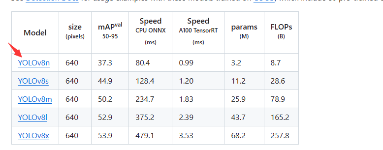
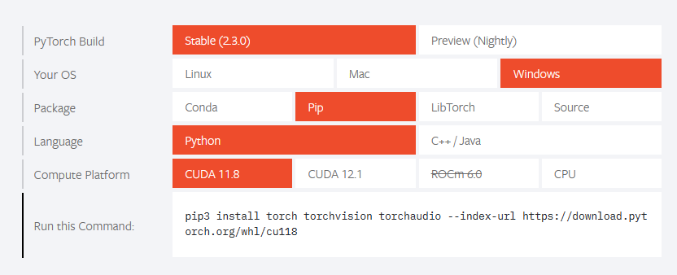
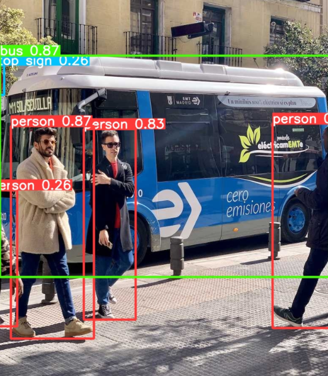
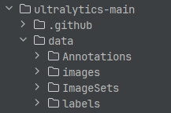
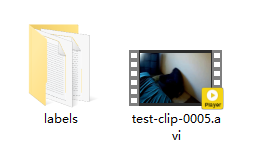

# 教程

# 一.前期准备

## 代码下载

去==GitHub==上下载[`yolov8`](https://github.com/ultralytics/ultralytics)，直接下载整个压缩包，或使用​`git clone`​指令克隆

​​

**解压压缩包，会出现**==ultralytics-main==**文件夹📁**。

**下载预训练模型，这里推荐**​`yolov8n.pt`​(选择其他的模型也可以)

​​

下载好的模型放在==ultralytics-main==目录📁下

## Python环境准备

> **对于我来说，当时就安装了**​==**​ `ultralytics` ​**==**和**​==**​ `pytorch` ​**==**之后就不用安装其他的了，所以我也依照我这个来说需要怎么准备环境**

**去**​[PyTorch官网](https://pytorch.org/)获得安装相应版本的安装命令

​​

> **这里网上很多教**​**程我就不细****讲了，主要就是是**​**==NVDIA显卡==****的就安装**​**==CUDA版本==** **，这样之后训练模型使用GPU训练会快一点。**

**==PyTorch==****很大，而且站点**​**在国外** **，建议翻墙，或者使用国内源，我是使用的翻墙进行下载的。**

**然后安装**==**ultralytics**== **,使用命令：**

​==**​`pip install ultralytics`​**==​​

**这样**​**==Python==****环境配置完成**

## 检验环境

**在**​**==​`ultralytics-main`​==**​**目录📁下打开终端(博主使用的Pycharm)，输入命令：**

**​`yolo predict model=yolov8n.pt source='ultralytics/assets/bus.jpg'`​**

**如果运行成功会在**​**​`ultralytics-main`​**​**下生成**​ **==\runs\detect\predict==**​ **，且文件中会包含一张预测的图片：**



‍

# 二.模型训练

## 前期准备

**在**==ultralytics-main==目录下新建==data==文件夹；

**再在data目录下新建四个文件夹:** ==**​`Annotations`​**==​**文件夹📁，** ==**​`images`​**==​**文件夹📁，** **​`ImageSets`​文件夹📁，​`labels`​文件夹📁

**创建完成之后**​==文件结构==如下：

​​

**使用**​imgclip.py​**代码，截取图像，再把图片放入**​==**​`images`​**==​**文件夹📁中**

**使用**​yolotxttransfer.py​**代码，生成对应图片的标注文件，放入**​==**​`Annotations`​**==​**文件夹** **📁(其实都可以不放，因为生成的标注文件已经是**​==**​`yolov8`​**==​**的格式了，只用放在**​==**​`labels`​**==​**即可)和**​==**​`labels`​**==​**文件夹📁** 

## 数据集处理

**在**​==**​`ultralytics-main`​**==​**目录下，使用代码**​split_train_val.py​ **，运行该代码会在imageSets文件夹下将数据集划分为训练集train.txt、验证集val.txt、测试集test.txt，里面存放的就是用于训练、验证、测试的图片名称。**

‍

**在**​==**​`ultralytics-main`​**==​​**目录下，使用代码**​labeltransfer.py​ **,运行该代码会在data文件夹下得到三个包含数据集路径的txt文件，**​==**​`train.tx，test.txt，val.txt`​**==​​**这3个txt文件为划分后图像所在位置的绝对路径**

## 模型训练

**编写训练配置文件**==**​`mytrain.yaml`​**==​ **，代码内容如下：**

> **PS:上面三个路径请填写自己对应文件的绝对路径，这里的文件填写 `labeltransfer.py` 生成的文件，nc是类别数，names就是各个类。**

```yaml
train: D:/code/pyproject/opencvlearning/ultralytics-main/data/train.txt
val: D:/code/pyproject/opencvlearning/ultralytics-main/data/val.txt
test: D:/code/pyproject/opencvlearning/ultralytics-main/data/test.txt

# number of classes
nc: 249

# class names
names:
  0: blowtorch
  1: tape
...
```

**在**​==**​`ultralytics-main`​**==​**目录📁下打开终端，输入以下命令进行训练**

```powershell
yolo train data=data/data.yaml model=yolov8s.pt epochs=300 imgsz=640 batch=8 workers=0 device=cpu
```

> **==data==**​**为yaml配置文件，后边填写你的配置文件的路径**
>
> **==model==**​**为下载的预训练模型，在主文件下**
>
> **==epochs==**​**为训练轮数**
>
> **==imagez==**​**为训练时ai看到的图片大小，检查大图片建议使用640，小图片可以320 越大越吃性能**
>
> **==batch==**​**为一轮训练中每一次放入图片数量，越大越快效果越好，但是对性能要求越高**
>
> **==workers==**​**必须为0否则出错，网上有相关资料可自行查阅**
>
> **==device==**​**为使用的设备，使用cpu练就写cpu，使用显卡大多数都是0，多显卡就0,1,2...多少显卡往后写多少**

‍

# 三.使用训练模型

## 训练结果

**训练后的结果放在**​ ==**\runs\detect\train**==​**的目录下，其中里面多余的东西暂且不表，大家也可自行网上查阅相关的资料，在这个文件夹📁下有一个**​==**weights**==​**文件夹，可以看到有个**​==**​`best.pt`​**==​**的文件，这就是训练后的模型，之后在训练的命令中输入该模型的路径就可以实现在之前训练的结果上继续训练。**

## 视频目标检测

​==**​`ultralytics-main`​**==​**目录📁下打开终端，输入以下命令进行预测：**

```powershell
yolo task=detect mode=predict conf=0.15 model=runs/detect/train4/weights/best.pt source='E:/CVtask/test
_clips/test-clip-0005.mp4' classes=[14,15,19] save_txt=True
```

> **详细参数可以去yolov8的官网进行查阅，我只介绍几个关键的**
>
> **==conf==**​ **：置信度，当大于该值才识别**
>
> **==model==**​ **：使用的模型，填写我们训练的模型即可**
>
> ==**source**==​ **：预测的视频的路径**
>
> ==**classes**==​ **：预测哪些物品，建议一个视频只预测那些应该存在的物品**
>
> ==**save_txt**==​ **：保存txt结果**

**使用该命令后可以在**​ ==**\runs\detect\predict**==  **(注意，你每预测一次，都会生成一个新的predict文件夹，命名方式是predict然后是predict1，predict2...)查看结果。**

**有一个**​ ==**​`.avi`​**==​**的视频和保存的**​==**txt**==​**结果**

​​

‍

## 填写json文件

**使用代码**​txt2json.py​**代码将识别的结果写入**​**==​`json`​==**​**文件中，至此，实验完成，**

‍
